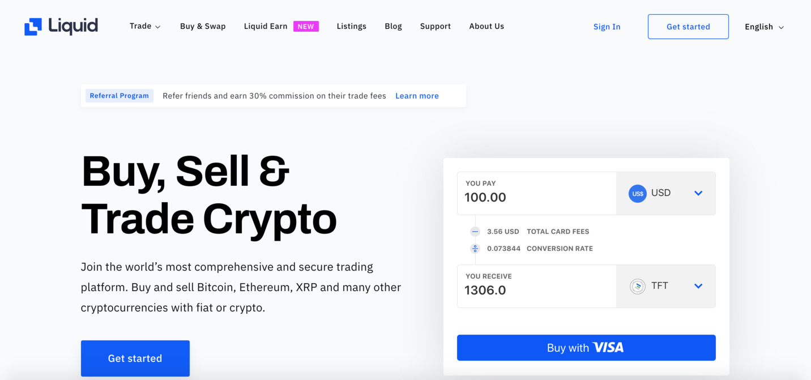

# Buy from Liquid Exchange

Liquid is a highly-reputable and highly-secure exchange and we are proud to have them as one of our listing partners.

### How to Register

*Please note that Liquid does not support all countries. Find the list [here](https://help.liquid.com/en/articles/2272984-can-i-use-liquid-in-my-country).*

1. [Visit Liquid](https://liquid.com)
2. Click on “Sign Up” in the top-right corner & follow the instructions.

*Note: Signing up is a quick 3-step process & will take just a minute.*

3. You’ll be asked to confirm your email. So, please check your inbox.
  - When you click “confirm” within the email, you will be taken back to Liquid
  
4. Within a few minutes, you will receive an email confirming your account and an email regarding verification. Follow the instructions in the email you receive. Although, see our note below to complete your verification.

*Note: If you’re not given the option to verify via video but would like to do so, follow the instructions [here](https://help.liquid.com/en/articles/3104816-video-call-kyc-verification). If you choose to verify via the website, [here is a full explanation](https://help.liquid.com/en/articles/2273305-how-do-i-verify-kyc-my-liquid-account) of how to do so & what you will need.*

Please note Liquid has a mobile application which might be easier for you to do your verification. It will use your phone camera to “capture” your selfie, passport, and proof of residency information.

**Again, please note you are not fully registered until you verify your account.**

### Enable two-factor authentication

It's quite simple to set up two-factor authentication (2FA) – and from a security standpoint, it is highly recommended. You can learn more about it [here](https://help.liquid.com/en/articles/2273273-how-to-set-up-2fa).

### Now you are ready to buy tokens on Liquid!

1. First, you'll need to [deposit fiat](https://help.liquid.com/en/articles/2275495-how-do-i-deposit-fiat) into your account
    - You can also [deposit cryptocurrency](https://help.liquid.com/en/articles/2275493-how-do-i-deposit-crypto) from any exchange to Liquid, if you have it / prefer to do that
2. Then, you will need to exchange your deposited fiat or cryptocurrency into either BTC (Bitcoin) or USDT (Tether)
    - These are currently the only trading pairs available with TFT
    - A trading pair is basically a currency which can be used to exchange or trade with another currency
    - **If you need help on trading, you can find it [here](https://help.liquid.com/en/articles/2275743-how-do-i-make-a-spot-trade)**
3. Now you can start buying TFT
    - If you want to trade on TFT/BTC pair, click [here](https://app.liquid.com/exchange/TFTBTC)
    - If you want to trade on TFT/USDT, click [here](https://app.liquid.com/exchange/TFTUSDT)

**Liquid has some [helpful guides](https://help.liquid.com/en/collections/1110080-getting-started-with-your-liquid-account) with everything from getting set up to depositing currencies, trading, and withdrawing – and a good support team.**

### Liquid Quick Exchange

Liquid also has a Quick Exchange, which allows you to buy TFT with a Visa card. Learn more [here](tft_liquid_quick_exchange).

!!!include:token_toc