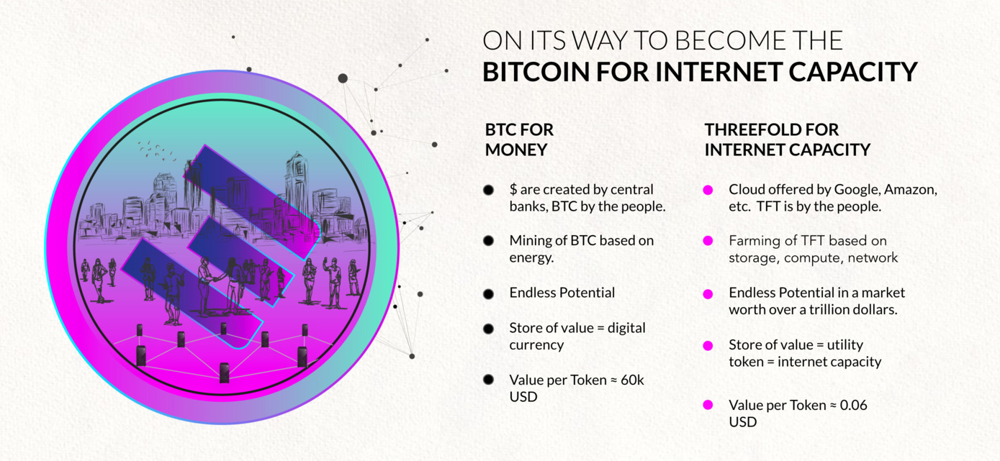

# ThreeFold Token for Beginners

While this section of the library covers all of the aspects of the ThreeFold_Token, we  understand that some people may be new to digital currencies (cryptocurrencies) in general. If so, this section might be helpful for you! If not, please skip ahead.

### Is ThreeFold Token a cryptocurrency?

A cryptocurrency is a currency living on a blockchain. TFT lives on the [Stellar](tft_stellar_dex) blockchain, so it is indeed a cryptocurrency. However, there are many different types of cryptocurrencies.

As of today, the world mostly uses [fiat currencies](https://en.wikipedia.org/wiki/Fiat_money) in the form of bank notes, coins or electronic transfers. Any government-issued currency is fiat currency. That means the money supply and value is controlled by a central bank. Fiat currencies are not backed by any commodity such as gold or silver, nor do they have any intrinsic value. (This is not good.)

The functionality of a cryptocurrency is just that: a means of payment. It has the same features as money; it’s a unit of account, store of value, and medium of transfer. In essence cryptocurrencies are not that different from the physical coins that we keep in our pockets, just that they are digital, and not controlled by central banks.

However, cryptocurrencies come with many benefits over fiat currencies, as they represent an ultra-secure mode of payment on a decentralized environment that is not controlled by any government or bank. This brings a high level of trust.

As for the ThreeFold_Token, it is a utility token, which carries a wider functionality and purpose. Utility tokens do have value, but they cannot be considered as "money" as straightforward as others. A utility token provides value to holders in different ways, by serving some use case within a specific system / giving them access to a future product or service.

The ThreeFold_Token represents a unit of decentralized Internet capacity on the ThreeFold Grid. People are able to buy TFT and use it as a means of payment to reserve current or future Internet capacity and services on the ThreeFold Grid.

### Is TFT like Bitcoin?

Well, TFT shares similarities and differences with Bitcoin (BTC):

Similarities:

- TFT is decentralizing the Internet in the same way BTC decentralized finance.
- Just as no central bank is needed in the BTC model, no centralzied cloud such as Google, Amazon or Facebook is needed in the TFT model.
- Both networks allow transactions to happen peer-to-peer.

Differences:

- While BTC works on a proof-of-work algorythm, ThreeFold's proof-of-capacity builds on proof-of-stake which brings much more scaleability and efficiency to the model.
- While BTC is a cryptocurrency, it can only be used as a value exchange. TFT is a utility token, so not only does it have a given value but it can be used as a medium of exchange for Internet capacity.

### What is the process for buying ThreeFold Tokens?

There are different ways to [get TFT](how_to_buy).

#### Wallets

Some [wallets](threefold_wallets) let you buy cryptocurrency with a debit/credit card, bank transfer, or even Apple Pay. Geographical restrictions apply.

#### Decentralized Exchanges (DEXs)

Decentralized Exchanges are open marketplaces for TFT and many other tokens. They connect buyers and sellers directly.

Instead of using a trusted third party to safeguard funds in the transaction, they use code. The seller's TFT will only be transferred when payment is guaranteed. This type of code is known as a smart contract.

This means there are fewer geographical restrictions than with centralized alternatives (below). If someone is selling what you want and accepts a payment method you can provide, you’re good to go. DEXs can let you buy TFT with other tokens, PayPal or even in-person cash deliveries.

You will need a wallet to use a DEX.

#### Centralized Exchanges

Centralized exchanges are businesses that let you buy cryptocurrency using traditional currencies. They have custody over any TFT you buy until you send it to a wallet you control. Thus, we never recommend storing TFT or any other cryptocurrency on a centralized exchange.

When buying TFT on a centralized exchange you will first need to send fiat currencies to the exchange in order to buy digital currencies, such as BTC, to be traded with TFT – and vice versa if you want to transfer the value of your TFT back to your bank account.

Centralized exchanges usually require KYC procedures and have geographical restrictions.

#### Through Farmers

You can also buy TFT from Farmers, such as [Mazraa](mazraa), the ones that produce TFT by connecting capacity to the ThreeFold Grid. All you have to do is to get in touch with them and issue a request to buy TFT.

### More information on how to buy TFT

Find instructions on how to buy TFT in the [Get TFT](how_to_buy) section.

> It is incredibly important to take the process of signing up and buying tokens seriously and to follow all the steps carefully. While there's nothing to be scared of, you'll need to give it your full attention. There are many resources online to  guide you through the process.

!!!include:tft_safe

!!!include:token_toc

