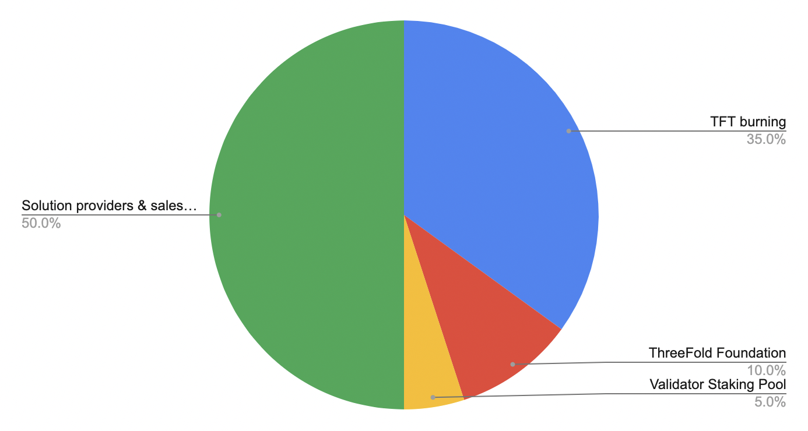

# ThreeFold Token Overview

> Max: amount of tokens = 4 billion, but its very unlikely we ever get there because of our Burning process.

Since genenis pool, all tokens that are being minted are the result of farming. 

See [Proof of Capacity](proof_of_capacity).

Proof of Utility Distribution Flow:

> For more details, see [Proof-of-Utilization](proof_of_utilization)

<!-- > For Detailed Info see: [Stats Token Overview, info from TFT blockchain](stats_token_overview) -->

## TFT Marketcap

!!!tokens type:total-liquid tftprice:0.12

## Remarks

!!!include:stats_toc
- [ThreeFold Token & Grid History](threefold_history)

!!!include:token_toc

!!!alias token_distribution,token_overview
