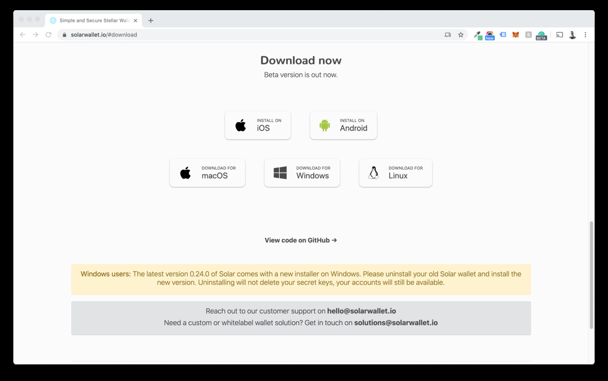
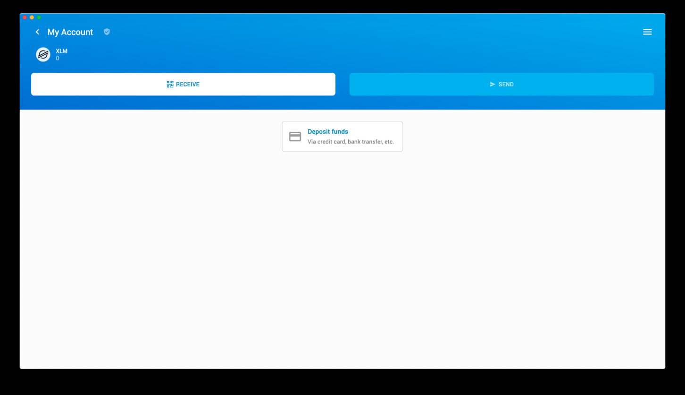
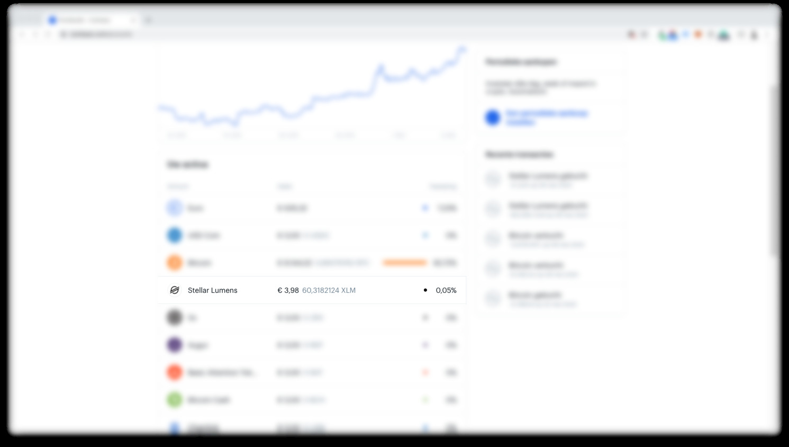
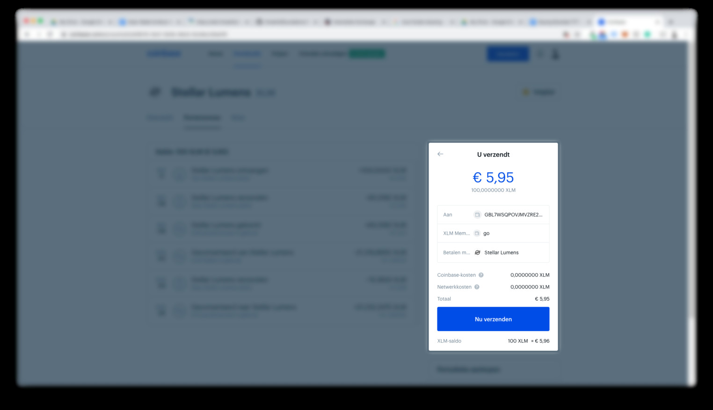

## Work with the Solar Wallet

### Step 1: Download Solar Wallet on your preferred device

For this manual we are going for the desktop wallet for MacOS. 

Choose yours at [https://solarwallet.io/](https://solarwallet.io/).

### Step 2: Install the application. 

See instructions.

### Step3: Create an account

Open your Solar wallet and click "Add account." 

This will take you through the process of creating a new account or importing an already-existing account.

You now have an empty Solar wallet.

## Step 4: transfer XLM to your wallet

Example done with Coinbase. In case you did not buy XLM yet go to this [example manual for coinbase](coinbase_fiat)

1. Copy your wallet address from Solar by clicking Receive and clicking on the address or QR Code. (This will copy the address onto your clipboard.)

1. Go back to Coinbase and click Stellar Lumens (XLM) in your wallet section

1. On the right-hand side of your screen, you can now fill in:

- The amount you want to send to your Solar wallet
- Paste the address of your Solar wallet (from step 1)
- Write a memo (can be anything, but is needed to process)

1. Click Send and fill in the two-factor authentication code. When all is processed, you will get a confirmation of the transaction.

2. Funds are now sent and showing up in your Solar wallet

### Step 5: Add TFT Asset to Wallet

<iframe src="https://player.vimeo.com/video/417197172" width="640" height="480" frameborder="0" allow="autoplay; fullscreen" allowfullscreen></iframe>

1. Click the top-right menu icon
2. Click "Assets & Balances"
3. Click "+ Add Asset To You Account"
4. Type "TFT" in the search box
5. Click "Add Asset To Account" (this will cost you a small amount of XLM to set up a so-called trustline for the asset)

The TFT icon will now show in your Wallet overview.

### Step 5: buy TFT

<!-- !!!vimeo id:417197931 width:640 height:480 -->

!!!vimeo id:417197931

1. Click on one of the currencies in the top bar to go to your wallet overview
2. Click ThreeFold_Token (TFT)
3. Click Trade
4. Click Buy Asset
5. Select TFT in the "You Buy" section and XLM in the “You Sell” section
6. Fill in the amount you would like to trade
7. Confirm the Sell order and wait for the TFT to show up in your wallet

!!!include:wallet_key_important

# Alternative Wallet Lobstr

see [Lobstr Wallet](lobstr_wallet)

!!!include:legal:tft_not_investment