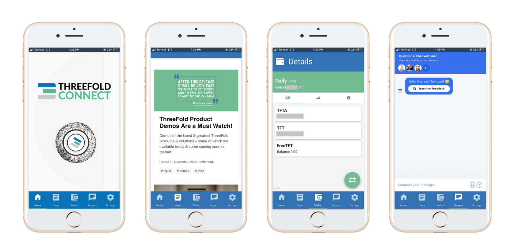

# ThreeFold Connect

ThreeFold Connect is an app that is more than just a wallet. It is:

- A wallet to hold digital currencies
- 100% private two-factor authenticator
- Mobile access to TF support chat
- Latest news & updates
- Integrated PAN

## GET STARTED

- **Step 1:** Download ThreeFold Connect
  - [iOS](https://apps.apple.com/us/app/3bot-login/id1459845885)
  - [Android](https://play.google.com/store/apps/details?id=org.jimber.threebotlogin&hl=en_US).
- **Step 2:** Create a 3Bot name and connect it to your email address.
- **Step 3:** A 24 word seed phrase will be generated to secure your wallet when signing up. 

!!!include:tft_important_notes

### Transfer TFT to/ from your account

Click on the double arrows at the bottom-right of your screen in the wallet section. 

#### Receive ThreeFold_Token

1. Choose the wallet to receive TFT 
2. Define the amount of TFT to be received
3. Create a message for the transaction details 
4. A QR code will be generated to issue the transfer from the sending account

#### Send ThreeFold_Token

1. Choose the wallet to issue TFT 
2. Add the receiver's wallet address
3. Define the amount of TFT to be transferred
4. Create a message for the transaction details 

You can also receive a QR code from your recipient that shall fill up all of the above details. In that scenario, just confirm the transaction to issue the transfer. 

> Important: You can always accesss your secret phrase, change your pin or delete your account in the settings tab of ThreeFold Connect.

> Note: If you find any issues across any of the above, don't hesitate to contact our support team on our website or web presence with the chat icon on the bottom right of the screen. 

!!!include:legal:tft_not_investment

!!!def alias:tf_connect,tf_connect_app