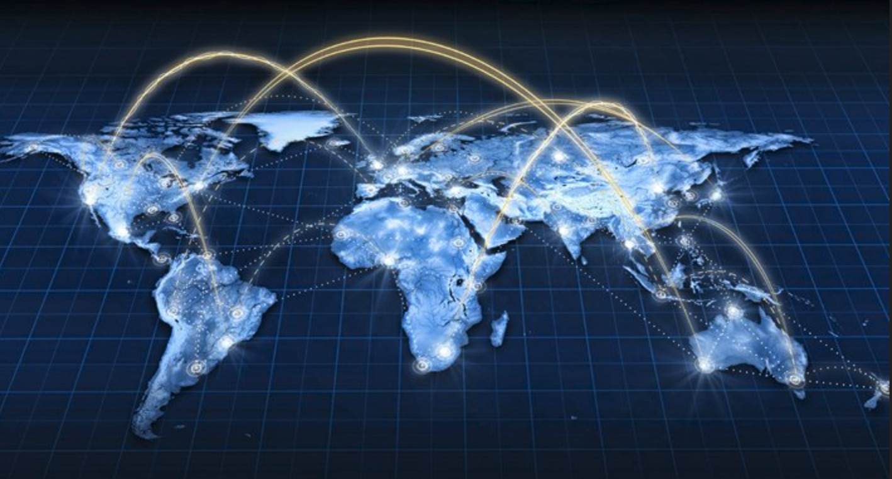

# Foundational Concepts 

## What is the Internet?

The Internet (or internet) is the global system of interconnected [computer networks](https://en.wikipedia.org/wiki/Computer_network) that uses the [Internet protocol suite](https://en.wikipedia.org/wiki/Internet_protocol_suite) (TCP/IP) to communicate between networks and devices. It is a network of networks that consists of private, public, academic, business, and government networks of local to global scope, linked by a broad array of electronic, wireless, and optical networking technologies. 

The communications infrastructure of the Internet consists of its hardware components and a system of software layers that control various aspects of the architecture. As with any computer network, the Internet physically consists of routers, cabling or radio links, repeaters, modems etc. An Internet Protocol address (IP address), a numerical label assigned to each device connected to a computer network, enables us to the Internet Protocol for communication and store/run data on the infrastructure.

The Internet carries many applications and services, most prominently the World Wide Web, including social media, e-mail, mobile applications, multiplayer online games, Internet telephony (calls), file sharing, and streaming media services.

Most servers that provide these services are today hosted in centralized data centers owned by a few large corporations. This centralized model is inefficient, as through it's centralized model, if the main servers go down, the whole system experiences downtime. Hundreds of downtime events have been recorded throughout the last few years. Also, given these companies own the data centers, they also own the data that is contained in them and use it for profit reasons. 

## What is autonomous technology? 

Autonomous technology is an emerging term for the technological developments that are expected to enable computers to run autonomously without human direction. An autonomous infrastructure would mean that the system would be self-healing and self-driving, without the need of any human intervention.

The ThreeFold Grid is the first autonomous grid in the world. There is no shell, local nor remote attached to the operating system - Zero-OS. It does not allow for inbound network connections from TCP/IP to happen. Also, given its shell-less nature, the people and organizations that run the servers cannot issue any commands nor access its features. All they do is connect the servers to electricity and network.

The smart contract for IT enables users to create the command functions (reservation of capacity, sending messages, store files, build applications, etc.) from their virtual system administrators (3Bots), that then execute these functions directly on the operating system level. Therefore, there is no need for any intermediaries between the user and the servers. 

## What does peer-to-peer mean?

Peer-to-peer ("P2P") computing or networking is a distributed application architecture that partitions tasks or workloads between peers. Peers are equally privileged, equipotent participants in the application. They are said to form a peer-to-peer network of nodes.

Peers make a portion of their resources, such as processing power, disk storage or network bandwidth, directly available to other network participants, without the need for central coordination by servers or stable hosts. Peers are both suppliers and consumers of resources, in contrast to the traditional client–server model (used by the current Internet) in which the consumption and supply of resources is divided. 

Emerging collaborative P2P systems are going beyond the era of peers doing similar things while sharing resources, and are looking for diverse peers that can bring in unique resources and capabilities to a virtual community thereby empowering it to engage in greater tasks beyond those that can be accomplished by individual peers, yet that are beneficial to all the peers.

Given anyone can plug-in servers to the ThreeFold Grid and that there are no intermediaries between the users and the servers, as well as between users and users, ThreeFold created a peer-to-peer Internet. 

Learn more about the peer-to-peer network on the ThreeFold Grid [here](znet).