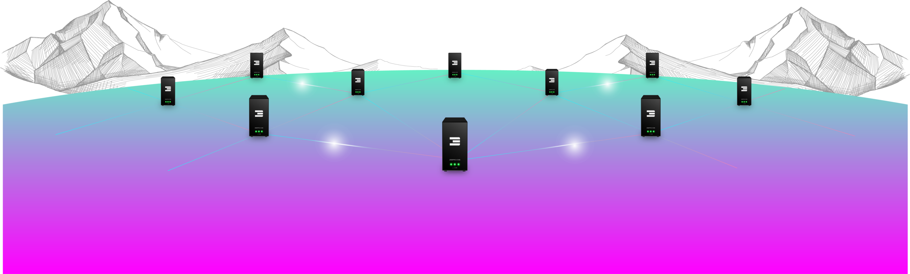
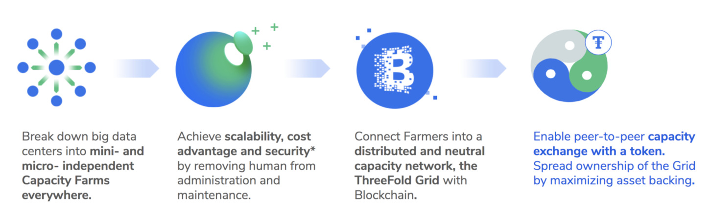
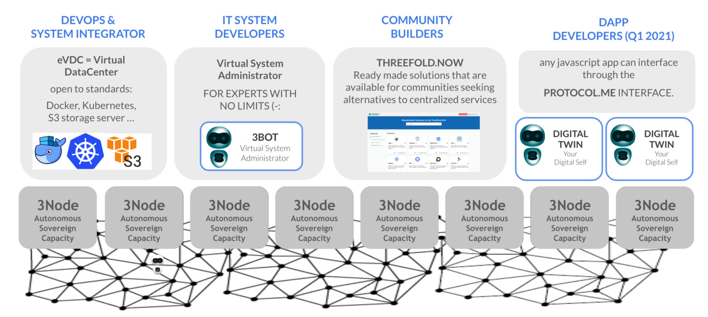

# Introduction 

!!!include:whatis_tfgrid

## Our Values 

## Why the ThreeFold Grid? 

The centralized Internet and cloud infrastructure is limited in scope and cannot scale with emerging data demands. While a centralized model can replicate itself and maintain high availability without compromising transaction rates using distributed system techniques, it is bound to limitations. The ThreeFold Grid demonstrates that the same theoretical limitations apply just as well to blockchains. The solution is to find a way to distribute the Internet infrastructure in such a way that nodes do not rely on one-another. Once nodes can become independent from one another, decentralized and distributed systems become applicable to Internet infrastructure and blockchains. 

The main difference between how the ThreeFold Grid operates compared to other systems is that it represents an independent full-stack Internet infrastructure comprising of:

- A **decentralized operating system** that decentralized the Internet infrastructure.
- **New compute primitives** to run virtual machines and containers in a decentralized way.
- **New storage primitives** that allows (almost) any storage tool or protocol to run in a distributed quantum safe way.
- **A secure peer-to-peer overlay network** improves network redundancy, performance and privacy.

  
The ThreeFold Grid produces a globally decentralized  Internet infrastructure that can run and store workloads independent from centralized APIs and networks. By leveraging blockchain technology, it removes all forms of intermediaries such as a centralized cloud service provider from the model and allows for users and developers to directly interact with off-chain compute, storage and network features via smart contracts. 

With TFChain, ThreeFold's blockchain on Parity substrate, people can deploy and operate private and sovereign development environments via smart contract and coordinate consensus independently from the network itself. And with the ThreeFold Grid's private overlay network, the infrastructure is able to do a limitless amount of transactions simultaneously, representing a major breakthrough over most blockchain-based cloud projects. 

The ThreeFold Grid is powered by ThreeFold's unique operating system, Zero-OS to secure the network and meet the efficiency and privacy requirements of emerging technologies such as the metaverse, blockchain, web 3.0 and alternative clouds. Any application which can run on Linux can run on top of the ThreeFold Grid with many advantages.

## Core Concepts

- [Zero-OS = our own operating system](zos), which allows any computer to generate compute, storage and network capacit for our decentralized cloud
- [3Node = any computer which runs zos](3node), provided by farmers who extend the TFGrid.
- [Our ThreeFold Token = TFT, empowers it all](whatis_tft)

<!-- Learn more about smart contract for IT [here](smartcontract_it). -->

## A Decentralized and Circular Internet Ecosystem 

<!-- 

Note: This image is stored as a slide in case the text needs to be edited. You can find it here: https://docs.google.com/presentation/d/1SoC_5qdbv31DccCEWnytsH7dUkGaR8UH0Va0cMVUJXY/edit?usp=sharing.

-->

<!-- 

NOTE: Would remove the below section as it created expectations. Would keep it short. 

## Grid Users

### Developers use the Internet Capacity

Anyone can build applications and services on the ThreeFold Grid as an alternative to doing it on a centralized cloud like Google Cloud or Amazon Web Services.

### A limitless environment for experts

A software development kit (SDK) is available and provides expert developers with great automation tools to scale their applications and services limitlessly.  

### A platform for communities to thrive

ThreeFold created a marketplace of peer-to-peer applications that can be hosted by any community around the world to benefit from real privacy and freedom on the Internet.

### End Users

End-users use decentralized applications and consume resources on the ThreeFold Grid for which they pay in ThreeFold Tokens. -->
