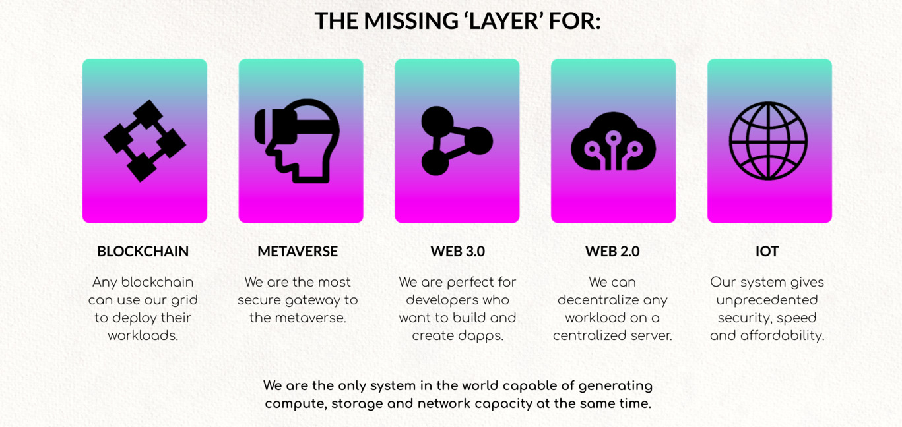
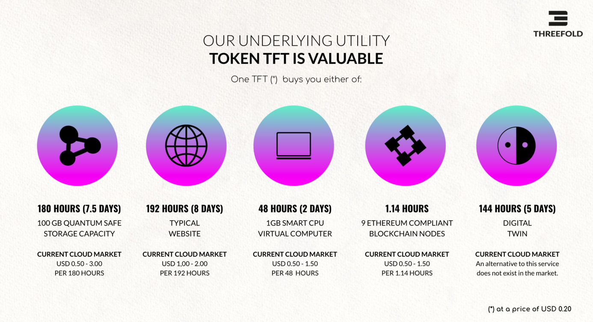
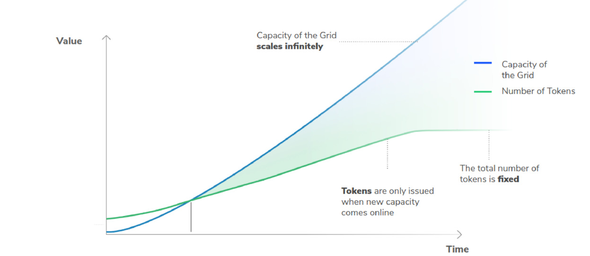

# How is the ThreeFold Grid valuable?

Demand for decentralized Internet capacity is exploding with the increasing data demands and emerging technology trends such as the Metaverse, Web3, Edge Computing, 5G, AI, VR and AR, IoT and more. The current centralized IT stack cannot support the growth of the Internet, and a new decentralized edge infrastructure is needed to support current and future IT workloads. 

## What's the potential of the ThreeFold Grid?

Internet infrastructure represents the foundation for the Internet and Cloud. Without compute capacity, applications wouldn't be possible, without storage data would be lost forever, and without network we wouldn't be able to communicate digitally. Put simply, the Internet infrastructure is like the body that allows the Internet to be alive. It represents the backbone of all of our digital experiences. 
The ThreeFold Grid represents the next evolution of Internet infrastructure as it is more efficient, advanced, sustainable and it can scale to the far edges of our world in a decentralized way. Emerging IT workloads such as the Metaverse or blockchain need a new infrastructure paradigm to scale, and market trends show an increasing demand for data privacy and improved bandwidth speeds. 

The current global Internet and cloud market it is expected to triple in size by 2025. Considering that the ThreeFold Grid provides the ideal infrastructure for emerging trends and assuming a 10% market share of the USD 800 billion public cloud market by 2025, this would translate into a USD 80 billion worth in data demand to utilize the ThreeFold Grid using TFT as a medium of exchange for Internet capacity.

## How is TFT valuable? 

A TFT represents a unit of reservation of Internet capacity (compute, storage and network) on the ThreeFold Grid ("Grid"). Internet capacity holds the most valuable commodity on earth - data - also know as digital gold. In that sense, TFT is a way to hold actual Internet capacity that can be used to store data and run workloads. It therefore has an unerlying value. 

Considering the infinite scaleability of the Grid, the limited supply of TFT and the burning mechanims in place, according to simple demand and supply theories, the value of TFT shall grow according to the growth of the ThreeFold Grid. At a higher valuation, a TFT will be able to reserve more Internet capacity.

TFT is minted only when new Internet capacity is connected to the ThreeFold Grid. In a way it can be considered to be backed up by hardware value. According to the Internet capacity they connect to the Grid in the form of compute, storage or network capacity, Farmers earn 

According to the market demand, ThreeFold Farmers are incentivized to contribute to the Grid's expansion early. 

> [More info about limited supply](tft_limited_supply)  

## How can the ThreeFold Grid connect billions of people?

While demand for the Internet and cloud is growing globally, the distribution of data centers is still highly concentrated in Northern America and certain parts of Asia. The following sources of information highlight the current or future distribution of data centers of market leaders. 

- [Amazon](https://wikileaks.org/amazon-atlas/map/) 
- [Oracle](https://blogs.oracle.com/cloud-infrastructure/oracle-launches-four-new-cloud-regions-across-four-continents)
- [Cloudwirx](https://www.cloudwirx.com/datacenters)
- [Microsoft](https://yellowduckguy.wordpress.com/2018/03/15/microsoft-worldwide-data-center-locations/)

The weak distribution of Internet capacity can be explained by the large amount of monetary, infrastructural, electricity, and security resources needed to operate hyper-scale data centers. The current model is not affordable to the developing regions of our world and the cost and complexity involved in producing compute and storage capacity can be covered only by current market leaders. This also means that all the data economy of these countries isn't owned by them, but by the tech giants. 

With about 45% of the global population that remains unconnected to the Internet, ThreeFold's scalable and efficient Internet infrastructure can provide and affordable way for emerging countries to expand their own sovereign cloud infrastructure at an affordable price. Instead of building billion dollar data centers at one go, a city can expand it's Internet infrastructure in a decentralized and incremental way

> Note: With Zero-OS being able to run on any Intel or AMD  hardware, refurbished hardware can also be used to lower the required investments. With such a model, hosting the digital lives of 1,000 people can be as low as a couple thousands of dollars in Internet ifnrastructure costs. 

Also, the ThreeFold Grid's model permits to bring Internet infrastructure to areas of our world that are not serviced by big cloud providers. Thanks to the hardware compatibility, autonomous featurues and decentralized model, a node can be connected at the edge wherever elctricity and network can be found, something that wasn't possible until today. This represents an opportunity to grow the Internet infrastructure to new frontiers while empowering local communities and economies. 

A comparison of the compute and storage capacity price of ThreeFold vs market leaders can be found [here](@cloud_pricing_compare)

## Disclaimer

> Disclaimer: Please note that we can't and won't make price predictions on TFT valuation and that all calculations made here are purely hypothetical. Use the simulator to make your own estimations.

!!!alias tft_valuation,token_valuation
