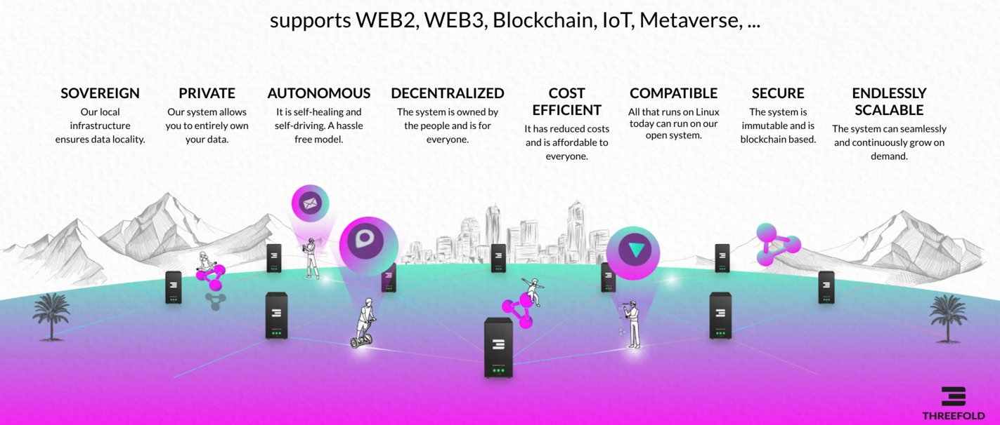
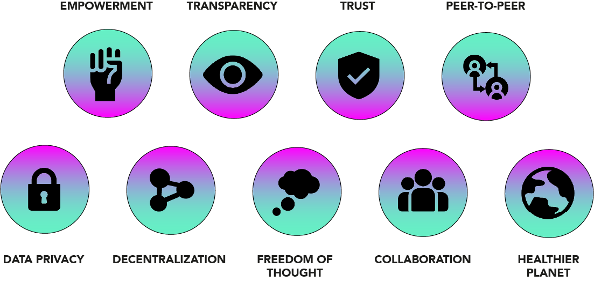

# Why the world needs the ThreeFold Grid.

In this section, we discuss the limitations and issues of the current Internet infrastructure on a high level perspective, and how the ThreeFold Grid provides a universal solution to power the next digital era. 

## The Internet needs an urgent update.

While technology is evolving faster than ever before and industries are digitally transforming themselves, today's global Internet infrastructure is struggling to keep the pace with these emerging trends. 

The Internet infrastructure represents the backbone of our digital lives. It consists of hardware and software infrastructures that form the **inter**connected**net**work of compute, storage and network capacity that allows us to build software, create applications, send messages or store our digital assets. Put simply, without Internet infrastructure there would be no Internet. 

Since the beginning of the millenium, spectacular Internet and cloud infrastructure advancemenets were made with hyper-scale data centers. However, the current Internet infrastructure model has many flaws. 

- **It is centralized:** The GAFAM (Google, Amazon, Facebook, Apple and Microsoft) own 80% of the global compute, storage and network infrastructures. Also the global infrastructure is concentrated in the U.S in large majority, as well as Europe and China. 
- **It is inefficient:** Most of the data centers are located in the U.S, forcing the rest of the world to connect via internet sea cables and having their data flowing outside of their borders and back. 
- **It is not scalable:** Emerging technologies require the global Internet infrastructure to triple in size in the next 4 years. It took 20+ years to build the current Internet infrastructure. So we need to build 3X more in 5X less time. 
- **It is not affordable:** It costs billions of dollars and enormous amounts of energy and time to build, manage and productize hyper-scale data centers. Only the richest countries in the world build data centers and the rest of the world become their clients. To meet the projected growth of the Internet in 2022, $5 trillion would have to be invested with this model 
- **It is not private:** Anyone can access Google Chrome or Facebook for free. But as outlined by movies such as the *Social Dilemma* or *The Great Hack*, if it is free, you are the product. The web's Ad model is threatening our privacy and the net neutrality of the global internet. 
- **It is not secure:** The current IT stack depends on human error and it has been considered as the major cause of cybersecurity breaches with more than 95% of the cases. Human errors allow attackers to access encrypted channels and sensitive information 
- **It is not sustainable** Data centers are extremely power hungry, consuming over 2 trillion gigabytes of storage and consume around 205 TWh - More than the State of New York. According to statistics, the Internet consumes between 10-20% of global energy resources. 
- **Cannot support future demand** To meet projected demand for 2022, more than 4,000 new data centers, costing an estimated $5 trillion, will be needed to build and consume an additional 400 GW/h. This is roughly equivalent to Japan’s energy consumption and would place an impossible strain on the global electricity grid. The rising demand for Internet storage is already causing hardware shortages and price hikes. 

<!-- ## The Internet the world needs. 

In order to create the Internet infrastructure that will support emerging market requirements and breakthrough the limitations of the current model, ThreeFold had to start from scratch and build a new operating system as well as compute, storage and network primitives. The result is:

- Fully decentralized: 

- Ultra-efficient:

- Limitlessly scalable:

- Extremely affordable: 

- Absolute privacy: 

- Quantum security: 

- Earth regenerative: 

- Built for the future:  -->

<!-- # Our Solution - ThreeFold

We decided to turn around the current digital miasma and create from scratch a new internet infrastructure that is decentralized, fully peer-to-peer, secured, and more sustainable - ThreeFold Grid. ThreeFold developed this new infrastructure formed by people and organizations that connect Internet Capacity (Compute, Storage, and Network Capacity) anywhere where electricity and network can be found. As such, this solution is providing the possibility for any country to have their own internet and be sovereign. This will, therefore, be the gateway towards providing the internet to the global population which will allow fair access to education, information, and knowledge - Knowledge is the key driver of prosperity, happiness, and the advancement of human civilization.  -->