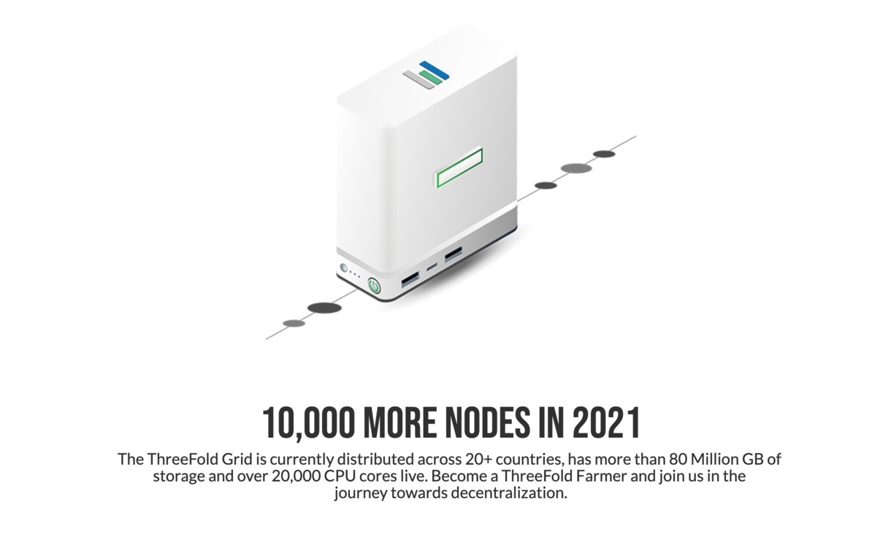

## Certified Node

A Certified Node is a node which comes BIOS locked and does not allow the owner change how the node boots.  

This makes it impossible for the node owner to make changes to the operating system and secure that the node will run the right certified version of Zero-OS.  

The Titan V2.1 node is a certified node.  Certified nodes are eligible for more [farming rewards](farming_reward).

### Requirements

- Node delivered by a certified hardware vendor or through the ThreeFold website.
- The farmer who owns a certified node will have to sign specifically created terms and conditions
  - not done yet, will be part of tfgrid 3.0 launch, see [here](farming_certification_terms_conditions).
- For 2.0 Farmers who started in 2020 or before: agreement about vesting see [vesting_overview](vesting_overview).

### More Info

- [Certified Farming](certified_farming)

### More Technical Details

- The BIOS gets locked.
- The BIOS gets configured to use TPM2 
  - more info about tpm2 [here](https://www.usenix.org/system/files/conference/usenixsecurity16/sec16_paper_raj.pdf).
- TPM2 is a security implementation on the motherboard which allows Zero-OS to securely store private keys, this mechanism is used to identify Zero-OS nodes and make sure they are registered as certified node.
- If a user would reset the BIOS then the TPM private keys are gone as well.
- Starting with our TFGrid 3.0 we will use this TPM feature to verify and validate some checks done from tfchain.
- A certified farmer is required to use certified_nodes.

!!!def alias:certified_node
