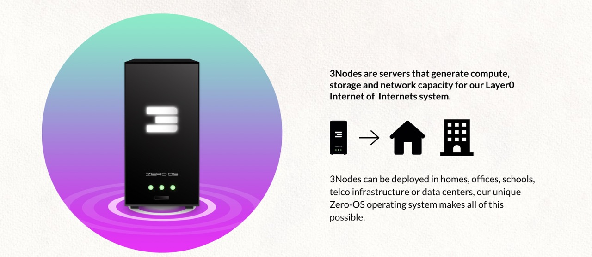
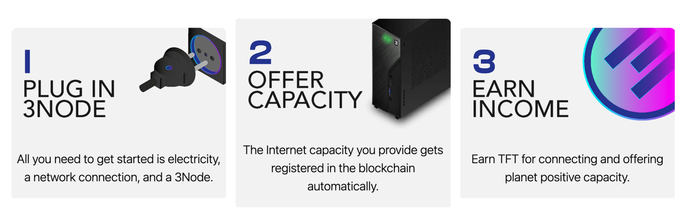
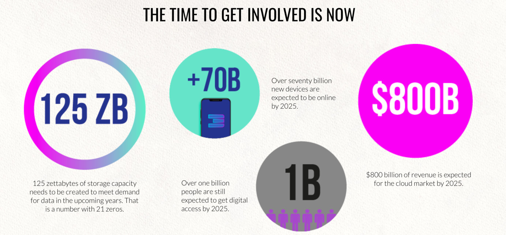

# ThreeFold Farming

  

ThreeFold Farming ("Farming") is the process of connecting Internet capacity to the ThreeFold Grid. This process is undertaken by independent people or organization called ThreeFold Farmers ("Farmers").

## What is Farming?

{{#include farming_circular.md}}

## Who can become a farmer on ThreeFold?

Technically, anyone can farm on the ThreeFold Grid using any server-type hardware. By using [Proof-of-Capacity](proof_of_capacity), farming was designed to reward all nodes equally according to the Internt capacity they provide to the ThreeFold Grid. 

## Cost of farming 

Anyone can become a Farmer, and there is no technical knowledge required. ThreeFold's autonomous system does all the heavy lifting, making it easy for anyone to join.

- Potential costs of the hardware necessary to provide Internet capacity and maintain a farming setup.
- Electrical costs to power the farm.
- Potential cost of equipment to support larger farming setups such as data centers (ventilation, monitoring, electrical wiring, etc). 

To further explore farming rewards, click [here](@farming_reward). 

## How ThreeFold Internet capacity is farmed?

1. A farmer provides Internet capacity by booting compatible hardware with Zero-OS. 
2. Once installed, Zero-OS locks the hardware and registers the Internet capacity in TFChain. 
3. Once verified by the [Proof-of-Capacity](proof_of_capacity) algorythm, the Internet capacity is made available to the network via the explorer. 

> Note: All the compute and storage data remains off-chain in order to protect the privacy of users. Once Zero-OS is booted, the device is locked in such a way that it no longer has any state or remote access, preventing farmers to access user data on a hardware level as well. 

## What kind of hardware can become a 3Node?

Any Intel or AMD server type hardware that contains compute and/ or storage can be connected to the ThreeFold Grid. Farmers need to download Zero-OS and boot their hardware.

Learn more [here](@farming_hardware_overview)

Once booted by Zero OS, the hardware becomes a 3Node, and its total capacity will automatically be detected and registered on the blockchain database. We call this Proof-of-Capacity.

Learn more about Proof-of-Capacity [here](@proof_of_capacity)

<!-- ## Why becoming a Farmer?

### Internet and Its Global Demand 

The Internet represents the largest economy in the world and is growing at a rapid pace.

The ThreeFold Grid offers the most scaleable, secure and sustainable infrastructure to supply the increasing Internet demand. 

Learn more about the ThreeFold Grid [here](grid_home).

### Sovereign and Recurrent Wealth 

By participating in the expansion of the ThreeFold Grid, Farmers earn TFT on a monthly basis. ThreeFold Token has value - it represents a unit of reservation of Internet Capacity on the ThreeFold Grid. With the infinite expansion of the ThreeFold Grid and the scarcity of mechanism of the TFT, there will be a constant increase in demand while a decrease in supply, thus providing value of its holders/Farmers. 

Learn more about Farming Rewards [here](@farming_reward). -->

!!!alias become_a_farmer