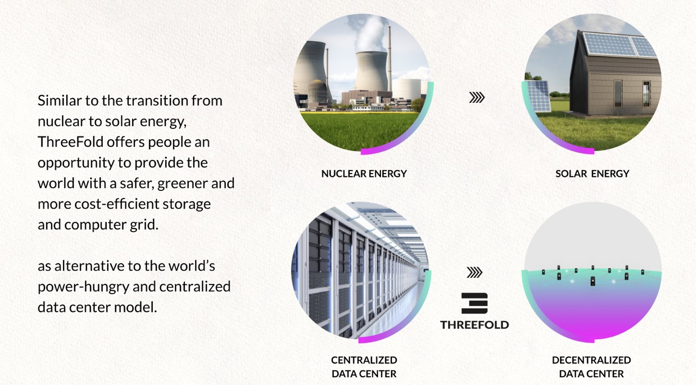
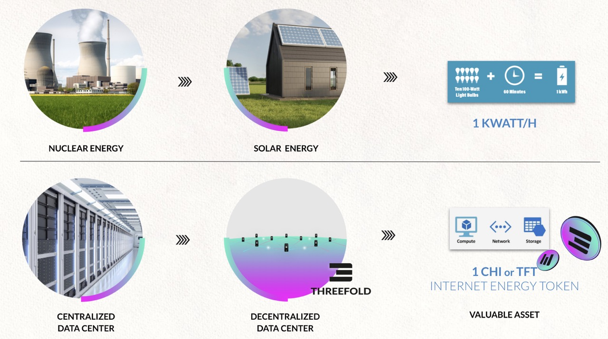
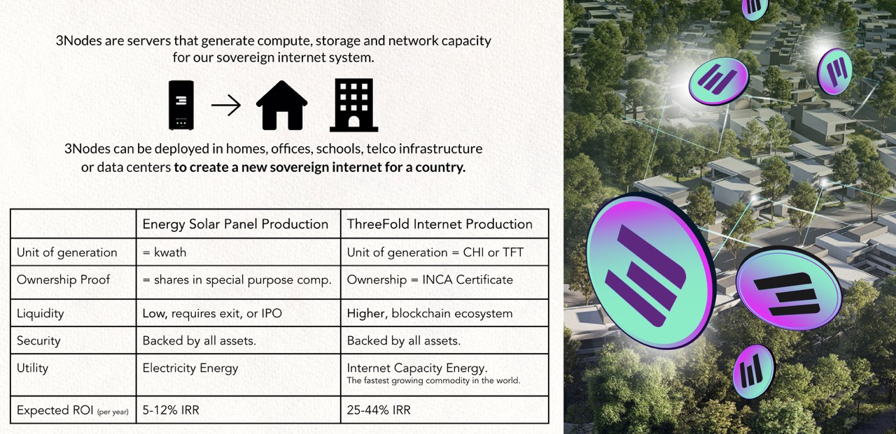

# Internet Should Be Generated Locally

> TODO: What is internet capacity, link to the internet pages at end

> TODO: explain farming

  

> TODO: explain how it doesn't make sense to generate far away

## TFT is the Utility Token of generating Internet Capacity

  

>TODO: link to cloudunits

## Nodes Get Deployed Everywhere

  

>TODO: link to the internet pages (at end)

>TODO: complete