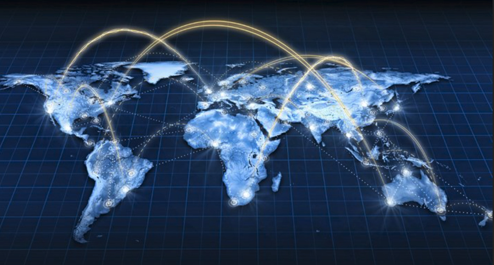

## What is the Internet?

The Internet (or internet) is the global system of interconnected [computer networks](https://en.wikipedia.org/wiki/Computer_network) that uses the [Internet protocol suite](https://en.wikipedia.org/wiki/Internet_protocol_suite) (TCP/IP) to communicate between networks and devices. It is a network of networks that consists of private, public, academic, business, and government networks of local to global scope, linked by a broad array of electronic, wireless, and optical networking technologies. 

The communications infrastructure of the Internet consists of its hardware components and a system of software layers that control various aspects of the architecture. As with any computer network, the Internet physically consists of routers, cabling or radio links, repeaters, modems etc. An Internet Protocol address (IP address), a numerical label assigned to each device connected to a computer network, enables us to the Internet Protocol for communication and store/run data on the infrastructure.

The Internet carries many applications and services, most prominently the World Wide Web, including social media, e-mail, mobile applications, multiplayer online games, Internet telephony (calls), file sharing, and streaming media services.

Most servers that provide these services are today hosted in centralized data centers owned by a few large corporations. This centralized model is inefficient, as through it's centralized model, if the main servers go down, the whole system experiences downtime. Hundreds of downtime events have been recorded throughout the last few years. Also, given these companies own the data centers, they also own the data that is contained in them and use it for profit reasons. 