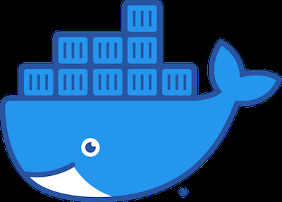
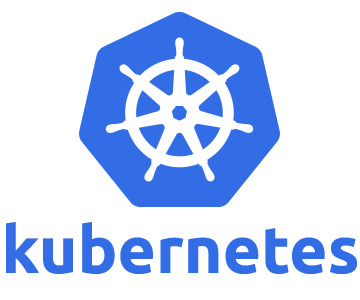
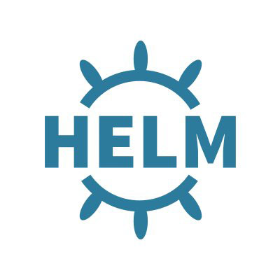

# IT-Standard Compatibility

To meet IT industry standards, we integrated the most used tools for IT workload deployments.

## Docker

Docker is the standard and most widely used container system.

It is supported on the ThreeFold_Grid through the Kubernetes orchestrator layer or directly through conversion into a flist on the [ThreeFold Hub](https://hub.grid.tf). Extensive Docker documentation can be found [here](https://docs.docker.com).

## Kubernetes

Kubernetes is the standard for container orchestration.

On the TF grid, someone can deploy a Kubernetes orchestrator out of the box. We have implemented [K3S](https://k3s.io), a full-blown Kubernetes offering that uses only half of the memory footprint. It is packaged as a single binary and made more lightweight to run workloads in resource-constrained locations (fits e.g. IoT, edge, ARM workloads).

## Helm

The process for deploying workloads on a Kubernetes cluster can be made easy by using Helm templates. These templates are YAML-formatted resource descriptions that Kubernetes can operate.
A [nice guide](https://helm.sh/docs/chart_template_guide/) describes all ins and outs of this widely used way of defining workload fit for Kubernetes.

# Filesystem

For storage, any file system will be supported; see our qsfs for more detail.