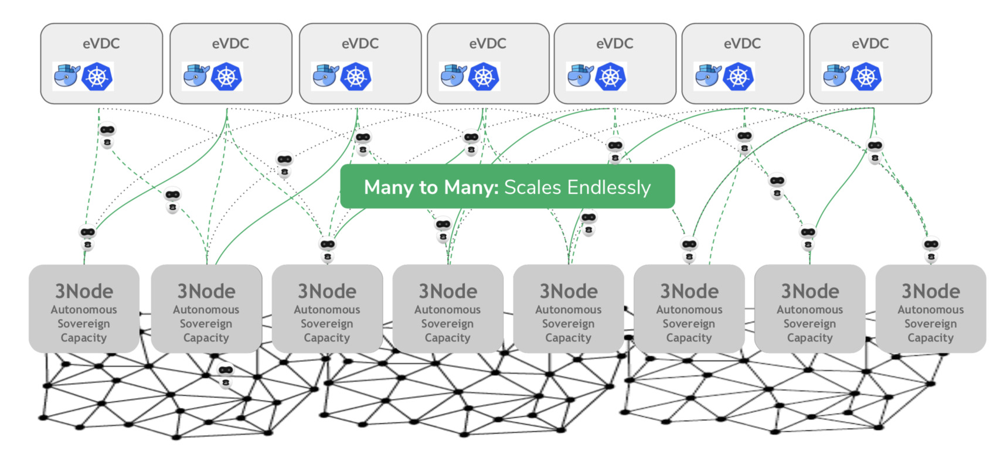

# Local and affordable everywhere

80% of the world's data currently resides in hyperscale data centers in central locations, which less than 20 organizations own. Compute power is centralized to specific locations. This centralization of power/ownership does not lend itself to equality in the data economy. We have already witnessed examples of major data breaches that benefit big tech corporations.

However, the trend is shifting: it is expected that by 2025, most of the world's data will move closer to where it is used. Local storage of data and computation at the edge will be required for smart cities, self-driving cars, 5G, IoT, Virtual Reality and many more use cases where quick response times are critical.

The Threefold technology brings privacy by design, whereby all data and applications remain under the user's control. Only the user can decide to share the data with others.

A decentralized architecture stimulates equality by disabling the accumulation of significant amounts of data from one player.

Moreover, a centrally organized internet architecture is unsustainable: the internet already consumes as much as 10% of the world ́s power generation today. The extremely high entry cost for setting up data centers and the high dependency on reliable power and network infrastructure are major factors that restrain digital infrastructure growth in emerging markets.

ThreeFold brings your data center to where you need it to be, on any scale, and very close to where it's being produced and consumed — facilitating infrastructure setup at the edge.

Related Reading:
- [ThreeFold Blog: Decentralizing the Internet](https://threefold.io/blog/post/decentralzing_the_internet/)
- [ThreeFold Blog: Data Center Myths](https://threefold.io/blog/post/big_datacenter_myth/)
- [ThreeFold Blog: Better Solution For Our Planet](https://threefold.io/blog/post/for_our_planet/)