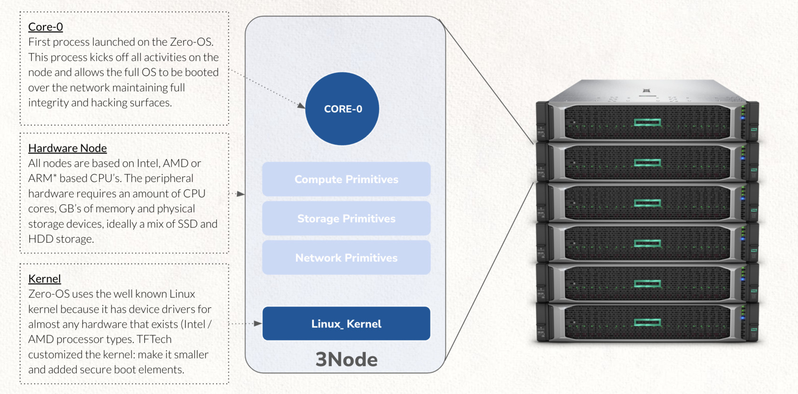

# A More Secure Cloud

## Running on an OS with minimal hacking surface

Zero-OS is a secure operating system that runs on Threefold nodes.

Some benefits:

- It has no shell, means farmers, i.e. owners of the capacity that hosts the OS and the workloads, have no access to the data residing nor the applications running on their hardware.
- It does not allow inbound network connections to the OS for administration and workload deployment activities.
- It is not installed on local (systems based) hard drives.  The OS os booted over the network with cryptographic boot file verification.  Physical disk access or a "man in the middle attack" do not allow hackers to succeed.

## Network security

- All networking in Zero-OS comes is set up as a private overlay network. All nodes have their own IPv6 address and are fully interconnected in the defined network. All traffic on the network is encrypted.
- Linkage for applications to the outside world is managed through the web gateways. These web gateways terminate all incoming traffic pretending to the the server and then initiate a new client service connection to the real application server.  This internal client server connection is initiated by the (real) application server, not from the outside.  This only allows external traffic that is initiated and accepted from inside.
- There is no TCP/IP traffic allowed coming from the outside. Data is picked up from the inside.

## Quantum safe Storage

The quantum safe storage solution splits data objects or even a full filesystem in an intelligent way into different parts, such that only part of the information stored in one place. Moreover, the data is described in a way such that a person aiming to hack into the low-level data (which is almost impossible in itself), will only find non-relevant information on this storage infrastructure.
The fact that no data part can be (re-)created by accessing one location, makes the storage quantum proof: no compute power can ‘imagine’ what the other data parts are by looking at the data part of a single location.

Since TFGrid 3.0 we also have a Quantum Safe Filesystem available. This Filesystem can be used inside VM's or Kubernetes. Which is an amazing feature because it allows you to store endless amounts of data in a Virtual Machine.

## Security in the deployment process

Deployment of IT workload using a so-called “Smart Contract for IT” makes the deployment process resilient to human error and hacking. The system is self-driving and self-healing, therefore removing the human requirement for deploying and operating IT infrastructure or services. This represents a breakthrough in IT. 

## Secure Decentralized access

Access your blockchain enabled workloads through Threefold Connect App. This app is a decentralized multi-factor authentication mechanism based on PKI technology.
