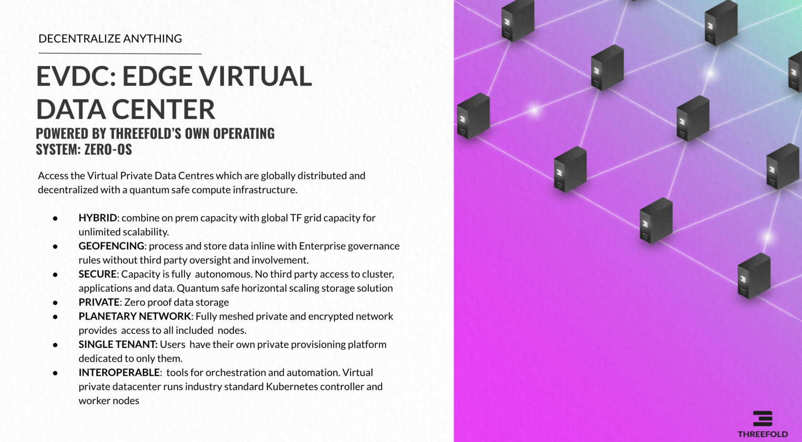

# Combine Cloud Agility and Sovereignty of On-Premise Data Center

## Benefit from Agility of Cloud

ThreeFold's allow you to create a Virtual Data Center within a few clicks, will call this an eVDC. 

For Containers:

- Provides agility to the creation and deployment of containers. It brings an easy and efficient framework to create container images as compared to VMs.
- Allows for continuous development, integration, and deployment, with quick and easy rollback.
- Applications are decoupled from the infrastructure, therefore isolating the development and operation concerns from each other.
- Easy management of health and behavior signals of the application.
- The execution of an application happens in the same way on a laptop/PC or in the cloud.
- Enables a full abstraction between running an OS and running an application within the OS.
- Allows for a micro-services architecture, cutting applications into small and independent building blocks that can interact dynamically.
- It encapsulates the application in such a way that the runtime behavior becomes predictable.
- An efficient use of hardware resources is possible.

Orchestration with Kubernetes provides users with lots of functionalities:

- Easy to set up and manage the execution of containers and the interaction between these containers.
- Services to facilitate access using DNS or IP address.
- Automated load balancing in case of high traffic.
- Automated rollbacks and rollouts.
- Self-healing architecture: if containers fail, Kubernetes restarts them, replaces them, kills or stops exposing them if they are not passing the health-checks.
- Management of secrets and configuration without the need to rebuild container images and without exposing them.

If you don't have enough capacity to run your application, you can create rules in Kubernetes to allocate more resources.

## Benefit from Security and Locality of an On-Premise Data Center

Many organizations don't dare (yet) to benefit from this cloud agility because they see possible significant drawbacks such as:

- By running their applications on a cloud, they commit their data to these cloud providers, which prevents them from controlling and securing their data in an understood manner.
Cloud architectures are more vulnerable to data intrusion, data theft, data ransom, and other malicious practices because a cloud provider is a multi-tenant set up by design. Many companies and individuals share the same infrastructure (servers, network, access portals etc.). Each of these shared multi-tenant installations brings particular security and privacy risks.
- Last but not least, in the unlikely case of data loss, data theft, or any other type of hacking occurs, who is held responsible?

The ThreeFold_Grid and eVDC have the solutions to the above challenges, making it possible for anyone to benefit from cloud agility.

### Local secure capacity

The TF Grid is designed in such a way that capacity can be added anywhere by anyone. All you need is a power socket and network connectivity to connect IT infrastructure in a remote area, local office building, private and public datacenter. Therefore, it is possible to create a local cloud infrastructure on-premise with ThreeFold technology that presents the same benefits as large-scale cloud infrastructures. This means companies can be their own internet (cloud infrastructure).

Zero-OS is the stateless operating system that runs on the ThreeFold_Grid hardware infrastructure, and it is available on hardware in any form factor. It can be installed easily, operates autonomously and has incredible security and privacy features.

Zero-OS was designed to enable servers to become part of the ThreeFold_Grid from anywhere (and by anyone). One key element to make this possible is to have an absolute minimal hacking surface on the physical server. In the end, servers will exist in many different locations and will be owned by many actors. A key element to secure the applications that run and the data stored on these servers is to make it impossible for humans to interact with these servers. To make this possible, Zero-OS was designed so that there are no login facility, store and access credentials, or interface for people to interact in any possible way with these servers.