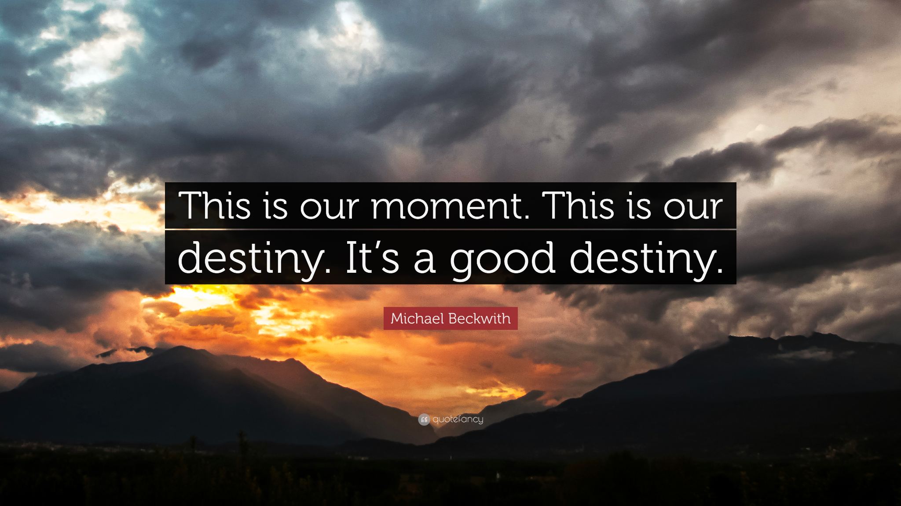
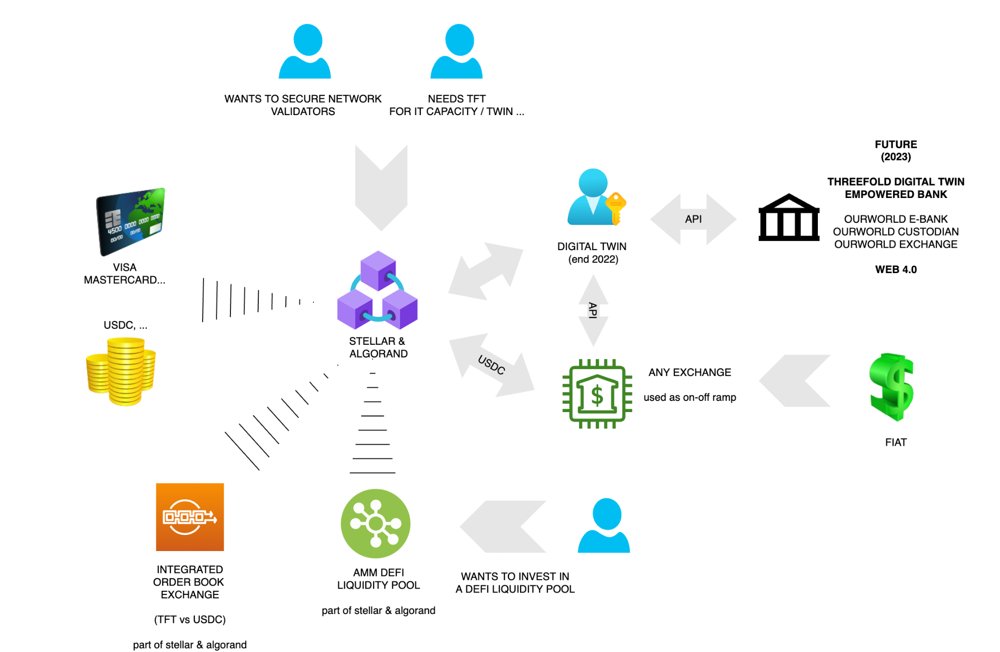
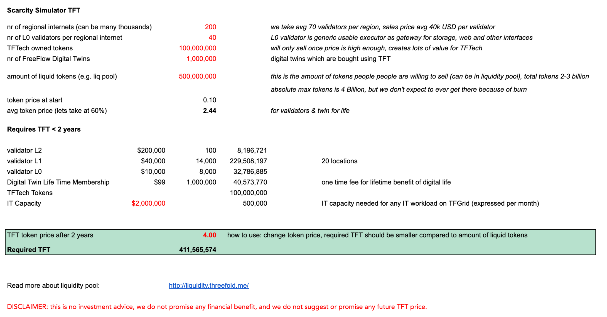
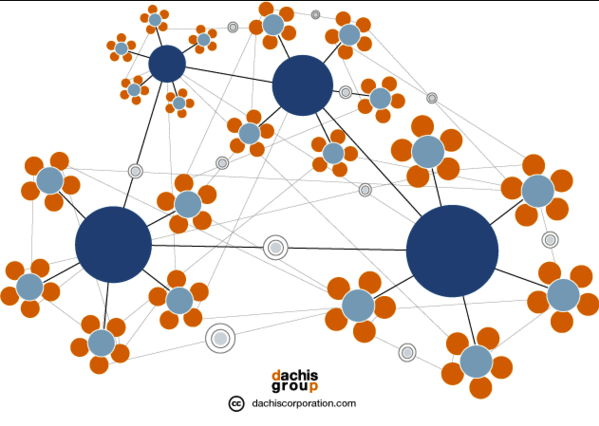

# Together we build our own future with the Internet of Internets.

ThreeFold is a movement. All of us together, we are creating the Internet of Internets – a system of local internets for us to connect and exchange information and value without limitations or intermediaries. 

To learn more about ThreeFold read our litepaper on [http://litepaper.threefold.me](http://litepaper.threefold.me).

Each local Internet is owned by all of us ("people"), together – an equality and abundance-based paradigm to benefit and provide fair value exchange for the collective and each of us individually. A planet-first, people-first philosophy that shapes the future we want to live in. Without our planet, we have nothing. And we believe people need a better system. One they can depend on. One that allows everyone to provide economic flow. One that gives them the opportunity to thrive.

This document describes how liquidity will be the result of real utilization which means:

* Deployment of validators on the main chain (L2 validators = staking).
* Deployment of validators for each regional internet 
* Funding of the liquidity pools in each regional internet (CHI vs TFT).
* Paying for utilization of the TFGrid + staking to get more discount on TFGrid.
* Reserve currency for all regional internets (CHI is only valid in 1 regional Internet, TFT allows bridging)

Because we don’t do fake market making and we didn't accept funding from investors to fund our token raise (some call this pump and dump), we will have to be patient and wait till more utilization is required till we get to enough liquidity. 

Our future is 100% decentralization where our token doesn’t need centralized market makers nor centralized exchanges. Every participant to the network can be a liquidity provider and our token is stored on multiple money blockchains (today we use Stellar, we are considering adding Algorand).

The ThreeFold token TFT is a token with real utility value and as ThreeFold we are only at the start of our journey.

**We are different and need to dare to be different.**

* We have a real valuable and technically advanced product, ready for a future the planet needs.

* We have a strong token, with a good tokenomics model, not made for pump and dump but for real value.

* The Internet of Internets concept will require billions of TFT to support its growth.

* We have a strong community of like minded people who want the ThreeFold project to succeed, 
so many are willing to offer their time to make it happen, thank you… 

* Even country governments and large banking projects start seeing the value of what we do.

# Index

[[TOC]]

# 

# This Is Our Moment

the world needs decentralization now more than ever, crypto is re-inventing itself 
		just like what happened in the dot.com crash, this is the ideal moment to break through.

We were preparing for this moment:

* Product ready, and good enough (yes)

* First traction for large projects which many users (yes)

* Community traction proven (yes)

* Ready to go viral (cheapest and only way it can work in a down market) (some more work)

* A team and core community capable to execute which is lean & mean (yes)

* A lot of cash on the bank, so it's easier to break through (not yet)

* Good values in place, and ready for the future (planet/people first model) (yes)

* Governance (working on DAO)

**Our values/strategy reminded:**

* **Right mix of Planet, People, Profit (no profit without taking care of planet and people on it)**

* **We will not do pump/dump, we will not do fake market making**

* **We will not do big marketing unless we get the right funding and now exactly who to target and when/why.**

* **We need product to be ready for the world (that's why we kept on pushing and we are there now)**

* **We should not do things which we can’t do yet (don’t run before you can walk, e.g. going too operational with the Grid we can’t we dont have the team nor funding for it, we are now fundraising to make this happen).**

**Next steps**

* **Fundraise to support global expansion as well as support community building (promotion, events, …)**

* **Expansion phase (get hundreds of thousands of nodes on the TFGrid as well as many regional internets)**

* **Launch first big usecases e.g. freeflow/uhuru (our digital twin)**

* **Deliver some of the big projects (millions of users)**

**We are a startup and community based organization**

* Which means we have to improvise, we need to see what works and what doesn’t

* Of course we make mistakes, but because we are flexible and we listen we can always adjust fast

**We have done this 2x before in previous projects , and planned for this, 
It's time to move & be one of the leaders of a new era.**

# TFT Financial Token Ecosystem

It's no longer needed for a currency like TFT to be on a centralized exchange, everything they have to offer is available on these modern money blockchain ecosystems like Stellar & Algorand. It’s incredible to see how mature these platforms became. The process is actually getting very easy. 

Benefits today:

* Availability of stable coins (gold, usdc, …). The ability to use physical gold as an example is amazing.

* Easy ways to exchange currencies against each other, there is support for automatic DEFI exchange as well as orderbook based exchange built into Algorand & Stellar. Some of the wallets are super easy to use and make it easy for users to exchange their TFT for other digital currencies like USDC.

* Easy onramp with debit/credit cards (upto couple of thousand of USD).

* If you want to work with larger budgets, you have to choose your onboarding platform (can be a CEX, but there are also specialized services doing just this), do your KYC and send the money to that platform. Once on board the digital currency e.g. USDC can easily be transferred to your wallet on Stellar or Algorand.

* Once in the digital realm, your life becomes so much easier. Transferring or exchanging money becomes super easy and more reliable, the transaction fees on Stellar and Algorand are super low, the transaction happens immediately, you get full transparency when doing an exchange on the chosen DEX. Using a centralized exchange is much more complicated and dangerous.

* Your digital assets are potentially much safer compared to a bank or central exchange. Most banks do play with your money which means you cannot be sure that you will never lose it. Central exchanges, well… don’t get me started, most of them are even much worse compared to a bank, and many have very poor moral standards. There are some good exchanges of course, but only use them when you need them e.g. they can be good to find more liquidity for certain popular currency pairs or as an on/off ramp of your digital assets.

We are working on a new set of manuals to make it easier for people to understand how to use this ecosystem.

# ThreeFold Twin with integrated DEFI Wallet (Q4 2022)

We are launching our Digital Twin (FreeFlow-Uhuru) at the end of summer 2022 and by the end of the year latest Q1 2023 our Digital Twin will have true decentralized finance capabilities.

Imagine your twin is your personal trading and exchange bot, you would become the exchange. You instruct your twin with e.g. I want to buy TFT at a maximum price of X, if that does not work in a certain time then pay 20% more. Now the twin on your behalf will talk with the other twins and the connected blockchain systems to see if a deal can be made and on your behalf get the best possible price. This twin doesn’t have to sleep and can work nonstop until your required result has been achieved. We can even implement personal liquidity pool functionality, so you can make some gain by providing liquidity to others.

* The minimum price will be defined by the DAO but not lower than 0.15 USD.

* People can define min price to sell, max price to buy and duration of their offer.

* The order books are not visible, this makes it much harder for bots to manipulate the price and volume. 

* The process is managed by your digital twin also a peer2peer defi system.

* The digital twin will also try to use above mentioned liquidity pools and optionally exchanges on your behalf.

* Each successful peer2peer exchange transaction gets registered in the blockchain, 
This way we have a market defined price really based on supply and demand.

The wallet would use our TF Connect security layer and needs to be the easiest possible wallet to use, we would work with 3e parties to make it easy to use FIAT currency as well to enter this system.

We would like to offer this functionality to other crypto projects as well, as long as they create liquidity pools with TFT as pair (-: 
We believe this is a very important missing piece for a more sustainable decentralized and safe digital currency world.

This system is not limited to only digital currencies but you can use the twin to find any good or service you are looking for as well as exchange any good/service for any digital currency/token. The twin will take care of all details.

We are working on some huge projects with millions of users who need this functionality (banks & countries). 

The concept of having your own twin which acts on your behalf we call web 4.0.

**DISCLAIMER: this is no investment advice, we do not promise any financial benefit 
and we do ****not**** suggest or promise any future TFT price.** 

# DAO based TFT Liquidity Pool (Q1 2023)

There are +-40m USD worth TFT, from which a small minority is liquid, there are billions of TFT required (see [litepaper](http://litepaper.threefold.me) and scarcity simulator below) this will lead to upward price pressure. We believe in organic growth of our token.

The liquidity on the exchanges (even on Algorand or Stellar) is low, this leads to inability for people who want to buy a lot of TFT, we don’t feel comfortable using commercial liquidity providers, we would rather work with our community and have our own community funded decentralized liquidity pool.

We are in the process of establishing a community based liquidity pool (additional to the DEFI pool of today):

* This liquidity pool is funded by USDC and TFT (and maybe a gold token).

* The min price the TFT will sell for from this pool is DAO defined price e.g. 0.15 USD 

* This is a DAO based liquidity pool, the TFT price and the spread 33% at start is voted on a weekly basis.

* TFT to USDC will be 33% lower price compared to USDC/PAXG to TFT. 
This 33% margin is fully added to the liquidity pool, this means the liquidity pool constantly grows in value (this is the margin for the liquidity pool providers), this is very unique.

**DISCLAIMER: this is no investment advice, we do not promise any financial benefit 
and we do ****not**** suggest or promise any future TFT price.** 

# ThreeFold Project Phases

The first phase has been focused on initial expansion and the creation of all the technology required (this is now completed). The next two phases are all about accelerated expansion, and this requires many billions of tokens and tens of thousands of servers, neither of which are available today. 

**Phase 1 = The Creation & Initial Roll out Phase (Completed)**

* Creation of the ThreeFold Grid, rewards for all early farmers & technology providers. +50m USD invested.

* Initial roll out, Proof of technology (we are now gen 3), every day new capacity is extended without our involvement.

**Phase 2 = Expansion Phase = Requires X Billion TFT = STAKING FOR EXPANSION
**

* This stage will need multiple billions of TFT, this will stabilize the TFT price & drive liquidity.

* Meanwhile the world is becoming less stable, more and more people realize they need a new Internet and more stable digital currency. Because of the underlying tokenomics, TFT might be a good future inflation hedge.

**Phase 3 = Web 4.0 Roll out = lots of utilization on TFGrid will be required**

* A first roll out for web 4.0 will be called Freeflow (Uhuru) , our alternative to +10 digital experiences.

* We are working on some big projects with huge communities which want to onboard our FreeFlow concept, some NEO banks as well as countries. This can lead to millions of twins which will lead to real utilization of the grid.

* Is in parallel with phase 2.

**
****Phase 4 = Velocity Phase = the engine is running at full speed = the world has a new internet (-: **

* TFT is needed everywhere to get access to 

    * Web 4.0 - hundreds of millions of twins

    * TFGrid Internet Capacity 

    * Rendering & Streaming capacity for Gaming & Metaverse Capacity (this will be HUGE)

    * DEFI Pools for more P2P currencies

* This will lead to increased velocity and flow, this is how a valuable digital currency is being created

* As part of this phase we burn (take out of circulation) more tokens than we create because of our burning concept.

*For Phase 2 and 3, we would require +100 Billion of TFT if the TFT price were not to rise from current absurdly low prices, there is simply nowhere near enough TFT available so the TFT price must rise as a consequence.*

# TFT Scarcity Simulator

We have created a simulator in which people can simulate how the Internet of Internets strategy needs billions of TFT which are not there yet. This simulator allows you to simulate the relation between size of grid and token scarcity.

In this simulation it's easy to see how many TFT we need depending on the token price, if the price is only 0.2 we need +4 billion tokens which are not available so in other words, the TFT price needs to be higher to be able this way people need to buy less TFT for their validators and twins. If we put the price on 4 it just works:

**
**Above simulator see [https://threefold.docsend.com/view/bevgqb3gm2vw2yeu](img/https://threefold.docsend.com/view/bevgqb3gm2vw2yeu) 

disclaimer: we are not making any promise about any token price of grid size, 
it's up to you to make your own assessment. TFT is not an investment instrument.

# 

# Internet of Internets Concept Provides Planetary Scale

The Internet of Internets system has one Mother DAI (Decentralized Autonomous Internet), which supports lots of regional Internets protected by Daughter DAIs. Each Regional Internet supports unlimited Community and Neighborhood Clouds which provide the Internet Experiences and Capacity (storage, compute) for its local users.

This provides for a scalable internet infrastructure which can scale to billions of people.

Community or Neighborhood Clouds are the foundation of this model, each of them providing all the required tools and applications for equal access to knowledge, education, business, financial systems, collaboration, communication and experiences for the community to thrive. A Community or Neighborhood Cloud is owned by its community members and provides for a completely decentralized Internet, by the people, for the people. Our Internet. Your Internet. 

The specific case of Neighborhood Clouds (defined as a deployment whereby ThreeFold Internet Capacity is deployed as part of a real estate project) is a good way to expand the Internet of Internets for the following reasons.

* The quality of computer hardware and associated equipment is high, reliable and well optimized 

* We can optimize the connectivity (e.g. fiber) and the operations cost is super low (power is free, zero data center cost)

* We can help emerging countries faster, they have many real estate projects being built.

* Utilization is built in, because the community will use the grid as well as government departments or surrounding businesses, and there is vested interest for the community to promote their Neighborhood Cloud.

* It's highly decentralized, each project is independent.

* A part of the funds received from a Neighborhood cloud can be used to support the TFT price.

# 
How do we scale to a Billion People?

Let's play with some numbers.

Together we grow an organic structure of 9,999 DAI’s, A DAI is a Decentralized Autonomous Internet.

* We need a MotherDAO with 99 validators which protects TFT (our own internet currency) and all DaughterDAIs.

* We need 99 DaughterDAO’s with 99 validators each to build our Regional Internets with own currency called CHI (local TFT)

* We need 99 interconnected Community/Neighborhood Clouds per Regional Internet, farming our CHI and providing our Internet Capacity (storage, network, compute) and all our Internet Experiences (apps).

This results in 9,999 (*) Validator nodes globally with a total of 9,999 Community/Neighborhood Clouds. If each community cloud is 999 nodes then we have a network of 9,999,999 nodes, this is enough to support 999,999,999 people. 

This provides for a very healthy start for our completely decentralized Internet of Internets.

						*(*) the nr’s are not mathematically correct, they are rounded for nicer representation.*

# TFT Utilization Model

The following 5 mechanism provide for TFT Utilization (drives scarcity)

1. Regional Internets: staking of TFT to establish the 99 validators per Daughter DAI* (many billions of TFT)*

2. Neighborhood Clouds buy back more tokens over the next few years. We expect to have +50m USD buying power over the next 24 months. It might well be impossible to spend this budget, because there is a possibility that there will not be enough tokens liquid to buy them as part of Neighborhood Clouds projects.

3. CHI genesis pool + CHI based personal liquidity pool *(many billions of TFT)*

4. ThreeFold Grid Usage, TFT is needed and also will get tokens to be burned.
Digital Twins: Millions of people will need their ThreeFold Keys (or Uhuru Keys) (already in phasee 3)

## 1. Staking requirement for Regional Internet

Each Regional Internet (Daughter DAI) is created by up-to 99 people deploying blockchain validator nodes. Each validator node needs about 50k USD worth of TFT staked. We are repeating this hundreds of times. This leads to +10.000 validators.

Once the blockchain validator nodes have enough funding then they secure the regional internet which provides completely independent Internet experience for millions of users. This allows for Community/Neighborhood Clouds to be established.

## 2. Neighborhood Clouds Buyback TFT from Market

A Neighborhood Cloud is a special type of Community Cloud project where a special purpose vehicle receives 1-5% of a real estate project. This 1-5% is used to farm TFT in and around the project as well as acquire tokens from the market if the price is low enough. The homeowner receives a certain amount of TFT over 5 years. Example in our first project, TFTech receives 5m USD, and the home owners receive 7 TFT per USD. This is a win-win for everyone involved. As a result the real estate project has their own internet with all the features required for the digital life of its citizens. 

About 20% of every Neighborhood Cloud proceeds is used to buy tokens from the market (if still possible at that time). Each Neighborhood Cloud has their price of TFT at start defined (we call it strike price) e.g. today we sold at about 0.1 over 5 Y, next deal 0.12, … If tokens today are < 0.12 we buy all tokens we can till 0.12, this way each Neighborhood Cloud project defines a next price for the token… It's a gradual token price increase in line to expansion of the grid and a bigger economical ecosystem.

There are now 2 projects 

* Paradise Hills -> 5m USD (signed)

* A new project in Dubai -> 8-10m USD (to sign < 4 weeks)

There is a large funnel, we expect to book more than 50m USD this year, this means +- 10m USD can be used over next year or so to buy back TFT as long as the price is lower than the strike price of the Neighborhood Cloud.

This shows how the Neighborhood Cloud concept has the potential to keep on supporting the TFT price in an organic way and this way provides benefit for the local community as well as the ThreeFold community in general.

## 3. CHI Liquidity Pools 

Each Daughter DAI has its own colored TFT and DEFI system. **This local TFT is also called CHI **and can only be used inside the Daughter DAI ecosystem. A CHI is generated as a result of people providing storage, network and compute resources to their local Daughter DAI system. CHI farming rules are defined by the local DAI and will be different region to region. Each Daughter DAI starts with 99,999,999 of genesis CHI which need to be bought from the Mother DAI by means of TFT. These genesis CHI are managed by the Daughter DAI and can be granted for work done or funds provided by the community. 

The DEFI system uses CHI as reserve currency, all trades in the peer2peer system are done against CHI. CHI is for Threefold what BNB is for Binance Smartchain. If you need CHI from another DAI you will have to go over TFT which is the reserve currency of the ThreeFold Mother DAI. This happens seamlessly for you, as part of your Twin For Life experience.

Everyone, by design, has the right and ability to become a liquidity provider. It won’t be like any centralized exchange platform. Instead it will be an organic experience attached to your digital self which allows you to create flow. Each and every one of us can decide how to provide liquidity and flow on a personal level – which allows for a self-governing system to emerge.

Each Twin For Life has its own set of Liquidity Pools.

You define per personal liquidity pool

* Amount digital currencies available to the pool (e.g. 1000 USDT, 0.2 BTC …).

* Amount of CHI or TFT available is the reserve currency (you can use TFT and CHI as reserve currency).

* Your liquidity pool Exchange Rules, assets you want to exchange and at what price

    * e.g. buy max 100,000 TFT < 0.15 USD, optionally linked to a specific group of people (we call circle)

    * e.g. sell max 10,000 TFT > 0.2 USD

*Your liquidity pool will at any point in time have a basket of your digital currencies and TFT/CHI. Important remark, you can use any currency in your ruleset, but exchange always happens against TFT or CHI. TFT or CHI is the reserve currency. Importantly, a pool always needs at least 30% of its value in CHI/TFT, otherwise the pool will not function, this makes sure there is enough liquidity available.*

More currencies will enter this liquidity model. With time we will integrate gold, carbon and other (value-backed) utility or monetary digital currencies.

The aggregation of the above individual pools will aggregate themselves to balance the whole economy – a peer-to-peer alternative to centralized liquidity pools – a real economy based on real demand and supply – an economy based on the golden rule and free will. It's important for everyone to provide liquidity, this keeps the system flowing.

## 4. ThreeFold Grid Usage Growth

While the grid is usable today the big growth is only expected once we reach more expansion and global reach.

In the last phase ThreeFold Grid usage leads to burning of ThreeFold token (see phase 4), this is another mechanism for scarcity.

# Expansion of our community building activities

Next year, we want to organize a ThreeFold Caravan of Light. 

A series of "plant the flag" events, starting in the US and Latin America where a group of people as a caravan of light go to places to plant a flag for a new internet.

This will happen by means of knowledge sharing motivational events combined with music and dance. For this we have support from an amazing team which is called Caravan of Light. It's a beautiful group of talented event organizers and network of artists.

We have now done a couple of events and it's incredible and very effective.

We will also continue our events on the Nile, 2 maximum 3 times per year we come together on the Nile expanding our community.

So far each event has been amazing accelerators for our growth, we just need to do it more and more organized, this in our opinion is the best spend marketing budget, it's much more concrete and allows a solid community to be born.

Community is what we are, this is the most solid foundation for our project to grow on. We are and need to be a globally happy connected family who chose to go out of victimhood and make change happen.

These events do cost money, but we believe they are the absolute most effective way to build community. 

Next events

* September Event in Greece (300+ people on a remote island, the celebrate the birth of our digital twin on ThreeFold)

* Nile Oct 2022

* Zanzibar TBD in collaboration with government

# More Info

[http://litepaper.threefold.me/](http://litepaper.threefold.me/) 

# FAQ

## I like what I see, how do I take action?

Contact us, we will help you to get on the liquidity pool or acquire a validator and start your own Internet of Internets.

## How do you see the future of crypto?

We believe it will be great but just like in the dot com crash, some correction is needed.

## How important are centralized exchanges these days?

These days it's not really needed any longer to list on big exchanges , see an article Kristof wrote recently [https://medium.com/@despiegk/crypto-is-dead-long-live-crypto-c3d1d774630c](https://medium.com/@despiegk/crypto-is-dead-long-live-crypto-c3d1d774630c) 

Ecosystems like Algorand and Stellar are amazing and have everything required to let us grow our token organically.

We are 100% compatible with market standards today like order book exchange and AMM Defi Pool (on stellar and on algorand, defi pool on algorand). Everything we use from echanges is natively available on modern blockchains these days, we support them on 2 major platforms.

## Is the grid usable?

Of course it is, people are expanding & using the grid today. See [https://library.threefold.me/info/manual/#/manual3_home_new](https://library.threefold.me/info/manual/#//manual__manual3_home_new) how to get started. Today everything which can run on linux can run on the cloud.

Of course there are some known (non blocking) issues

* The UI is not user friendly enough (will be fixed in next release).

* The documentation needs improvement

* We don’t have enough IP addresses (being resolved)

* We also need to be more clear about farming quality definition & measurement, 
it needs to be easier for people to define what a good farmer is.

Is the system good enough

* We believe so, if not let us know why not and what we need to improve.

We keep on working on improvements to of course address above, but first priority is on tools to do with VALIDATORS and FARMING and our DAO, this is the first requirement now.

The TFGrid has been fully functional since the start of this year in version 3.0. We have chosen to keep the Grid in an Alpha/Beta state for now, Google did this for years. There is an operational devnet, testnet and mainnet.

Version 4.0 is the version where we roll out support for the Regional Internet support.

We are launching end user facing projects like Uhuru over summer who have the potential to bring millions of users.

## What is your future plan for your financial ecosystem?

We are partnering with a project which is creating a regulated licensed 3 party financial system, in a whitelisted country without exchange control (means money can freely go in/out) with full support of the government.

* The **digital bank **allows for a personal bridge between digital twin, fiat, credit cards & digital assets.

* The **custodial bank** allows us to create and hold any digital assets (tokens) on behalf of our users.

* The **exchange** allows us to exchange regulated between any asset class in safe ways

The 3 financial institutions will be relying on threefold digital twin technology (web 4) and as such offer a super safe, sovereign, powerful but easy to use experience.

This is a huge opportunity for ourselves and our partners. We can help any partner crypto or digital currency project to allow people to work with their tokens in a fully regulated way.

This is becoming very important because certain crypto friendly areas are becoming greylisted like the UAE (see [https://complyadvantage.com/insights/fatf-blacklists-greylists/](https://complyadvantage.com/insights/fatf-blacklists-greylists/)) .

Our bank will be based in Mauritius which has no exchange control, is whitelisted and has lots of double tax treaties in place. More info see [https://www.trade.gov/country-commercial-guides/mauritius-trade-financing](https://www.trade.gov/country-commercial-guides/mauritius-trade-financing) 

