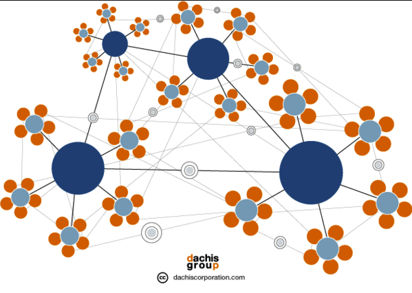

# How do we scale to a Billion People?

Let's play with some numbers.

Together we grow an organic structure of 9,999 DAI’s, A DAI is a Decentralized Autonomous Internet.

* We need a MotherDAO with 99 validators which protects TFT (our own internet currency) and all DaughterDAIs.
* We need 99 DaughterDAO’s with 99 validators each to build our Regional Internets with own currency called CHI (local TFT)
* We need 99 interconnected Community/Neighborhood Clouds per Regional Internet, farming our CHI and providing our Internet Capacity (storage, network, compute) and all our Internet Experiences (apps).

This results in 9,999 (*) Validator nodes globally with a total of 9,999 Community/Neighborhood Clouds. If each community cloud is 999 nodes then we have a network of 9,999,999 nodes, this is enough to support 999,999,999 people. 

This provides for a very healthy start for our completely decentralized Internet of Internets.

						*(*) the nr’s are not mathematically correct, they are rounded for nicer representation.*
