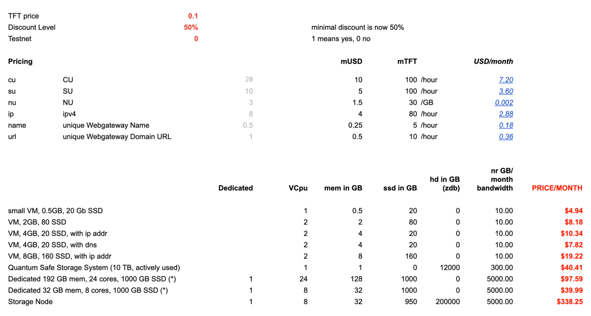

# Is our Solution Competitive?

The following section will demonstrate how our technology is capable of delivering Internet Capacity at a price way lower compared to any other technology in the market.

The following pricing is only for Internet Capacity, there are thousands of more use cases on top of the Neighborhood Cloud Concept, it's just to show that it works for the most basic use case = IT As Energy = Internet Capacity.

This is only with a 50% discount, partners can go to much more discount, the source doc can be found [here](https://docs.google.com/spreadsheets/d/1E6MpGs15h1_flyT5AtyKp1TixH1ILuGo5tzHdmjeYdQ/edit#gid=2014089775).

More info see [https://library.threefold.me/info/threefold#/cloud/pricing](https://library.threefold.me/info/threefold#/cloud/threefold__pricing) 

Compare with others [https://library.threefold.me/info/threefold#/tfgrid/pricing/cloud_pricing_compare](https://library.threefold.me/info/threefold#/tfgrid/pricing/threefold__cloud_pricing_compare) 

