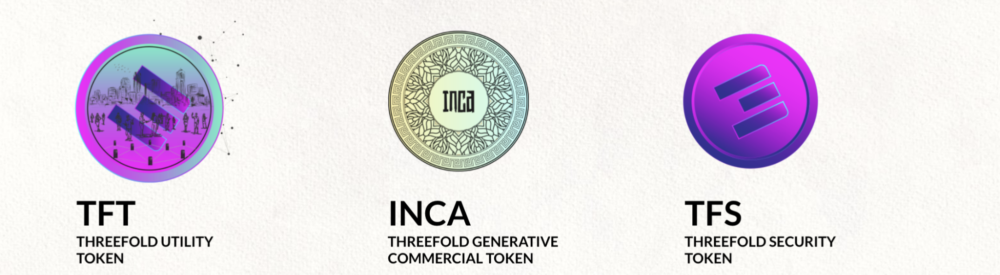

# The Three Tokens in the ThreeFold Ecosystem

## 

### ThreeFold Digital Currency For An Upgraded Internet = TFT

TFT gets minted (farmed) as a result of independent farmers producing Internet capacity and keeping it connected to the ThreeFold Grid (network).

TFT are partially burned (destroyed) as a result of people using the capacity. The value of the token will rise reflecting the growth, size and value of the ThreeFold Grid. Current liquid market cap is only 20m USD, marketing hasn’t started yet. At the present time TFT powers +50,000 CPU cores and +90,000,000 GB of storage.

### ThreeFold Generative Token = INCA (our commercial go2market token)

ThreeFold promotes the creation of Neighborhood Cloud projects together with real estate partners or other communities. Each project gets their own INCA (INternet CApacity) token. Each INCA generates a certain amount of TFT per month for 5 years. A Neighborhood Cloud allows the local community to experience ultra fast and reliable Internet with advanced use cases like rendering in the cloud of metaverse and gaming use cases.  It can be perceived as having access to your own supercomputer co-owned by everyone in the community. Not only does this supercomputer allow advanced use cases but it also generates income for everyone involved.

### ThreeFold Security Token = TFS (result of our investment round)

A real security token. Planned end 2022. The TFS = ThreeFold Security Token corresponds to shares in TFTech Company (Belgium) which is the company that develops and owns the open source technology which makes the ThreeFold Grid possible.  TFTech uses this technology for commercial use cases as well as building solutions on top of the ThreeFold Grid. TFTech also sells INCA Neighborhood Internet  projects (see above). 
