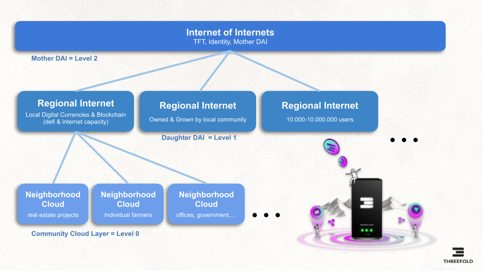
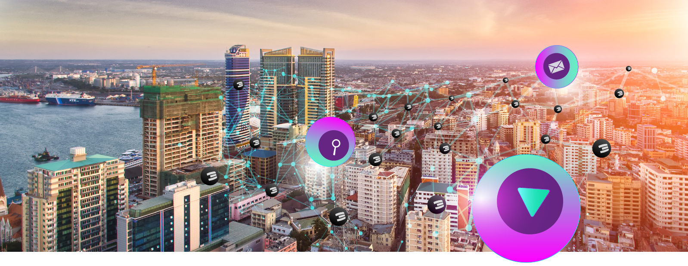

# Internet of Internets Architecture

We have developed a massive scalable Internet concept which has 3 layers. The Threefold Internet of Internets approach needs to scale to billions of users, and needs to be available at all times. We believe the best way is not to have one internet but many internets, hence the name Internet of Internets.

Above image shows how the Internet is hierarchical and scales forever. Each layer has a distinct purpose and allows the ecosystem to interact. While being hierarchical, it's still 100% peer-to-peer and decentralized.

Let's look at the different layers:

### 
