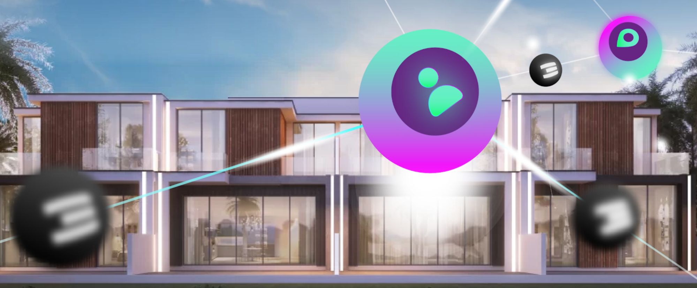

# Layer 1 = OurWorld Regional Internet 

Every community in the world can deploy their own Regional OurWorld Internet, a regional Internet that scales for millions of users. The Regional Internet has its own blockchain and can operate 100% independent from the other Regional Internets. Of course lots of connections are made between the Regional Internets.

A Regional Internet starts with max 99 founding fathers or mothers who deploy blockchain nodes with integrated support for DEFI. Each Regional Internet has its own ThreeFold Token (colored version), differences in farming & cultivation model are possible. Each Regional Internet has a DEFI pool to allow frictionless exchange between the master TFT and the TFT of each region.

This Regional Internet Enables

* A GDP positive system for the country the Regional Internet is hosted in.
* Independence, Sovereignty, Security, Green, Reliability, Performance, … No Need to build more data centers.
* A new Internet infrastructure platform (fully peer-to-peer and decentralized, and super reliable)
* A new decentralized finance & digital asset exchange system, based on values.
* A set of incredible experiences, with the ability to provide digital freedom for all our online requirements.
* An upgraded economic system platform = Web 4.0, a new way to communicate, share, collaborate

We want to make it easy for everyone to get started (as part of last fundraise project)

* A full ebook (hundreds of pages) with all details information as needed to deploy a Regional Internet
* Train the Trainer programs, to allow everyone to install their own Regional Internet.
* Augmented/Video education how to deploy such a system.

A Regional Internet comes pre-populated (as part of last fundraise project).

* We are executing on a huge effort to download and categorize +40 Petabytes of information from the existing Internet, this information will be available in each OurWorld Instance, making sure that all this information is protected and available to everyone in the world independent of what is or will happen
* We collect endless amounts of information (maps, educational content, source code, knowledge, ebooks, …).

Components of the Regional Internet

* Regional Internet Blockchain (RIB)
    * 9-99 validators (secures the local internet)
    * Hosts a local TFT (colored TFT with own price)
    * DAO for management of the local OurWorld Internet
* A DEFI system, allowing regional economic activities to take place (Q4 2022)
* Initial Internet Capacity to host the base Information & Educational Layer (+40 Petabytes needed at this stage)

