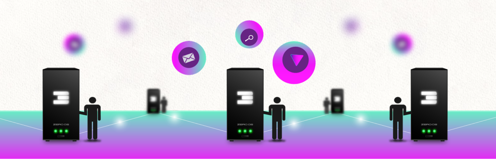

# Layer 2 = Internet of Internets = Mother DAI

The top layer, the home of the ThreeFold Token (TFT) and the base governance layer.

* Secured by 100 L2 validators \

    * The validator is funded and managed by a person who staked TFT (staking means locked TFT to the validator) to secure the validator. The 100 validators together need to find consensus about the transactions happening.
    * Each validator needs 2m TFT, growing to 3m TFT, everyone in the world can delegate their stake to these validators. \

* Following functions are implemented on the Mother DAI** \
**
    * Holds the ThreeFold Token = TFT, is our main digital currency blockchain.
    * TFT is the digital currency used to reward TF Farmers as well as allow people to consume Computer/Storage/Application/Network capacity from the TF Grid. 
    * DAI = Decentralized Autonomous Internet, each validator has a certain amount of votes  \
and can vote on functions to do with the functions of the blockchain. 
    * Reward system for the L2 validators, validators receive a reward for hosting the validator.

Everyone in the world can use this TFT to buy capacity from the Regional Internets (below) with just one currency called TFT.  \
5% of these proceeds go to the Validators. This is the global protection layer for all Regional Internets. 

Each Regional Internet will have a read only Validator as part of their Region, this to make sure that Layer 1 can never go down, not even if the Global Internet gets cut in pieces because of war, natural disasters or countries cutting off their Internet.

### 

