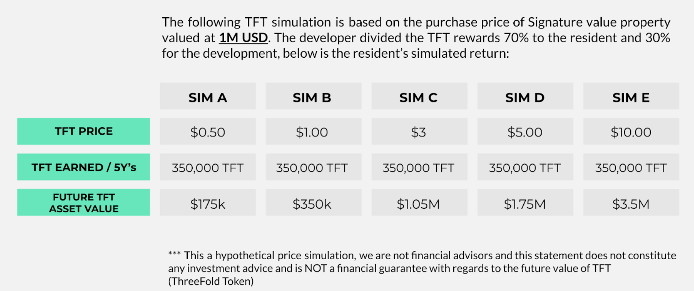

# Neighborhood Cloud Model

ThreeFold SA (TFTech) combines theInternet Technology with Real Estate and other Commercial Projects. This can be done for new as well as existing projects. A first project for 170 houses has been signed with 5m USD revenue for the foundation, a 2nd project is close to being signed for 300 houses, and we have 5 more Real Estate deals in the pipeline. We call this approach also INCA which stands for INternet CApacity.

### The Basic Pitch From Developer to Potential Homeowner or Commercial Property User

* INCA empowers projects to tap into the fastest growing economy in the world – the Internet and Cloud. 
* By equipping their Real Estate project with local Internet infrastructure, developers:
    * Turn their Real Estate properties into decentralized supercomputers that can support the emerging demand for Blockchain, IoT or the Metaverse 
    * Create potential future revenue for both the project and homeowners
    * Provide incredible connectivity to the real estate development

The best part is that that infrastructure doesn’t account for more than 1-5% of the cost of a property, and is provided as a gift to the homeowners. What better than to sell a house with a gift that invites homeowners to participate in the decentralization movement and that can pay back the property itself. 

### Example for a 100 house project:

Imagine each home average costs 1m USD. ThreeFold gets 1-5% of the real estate project total revenue. \
For 100 houses, this leads to 1-5m USD. We get this money as the project is being sold.

We don’t have to return the 5m USD, we create a token called INCA which returns TFT, our tokens.

An INCA (INternet CApacity) token generates TFT over 5 years. \
Right now, 1 INCA costs 5 USD and generates 50 TFT over 5 years, this number changes as the TFT goes up.  \
We expect 1 INCA to generate up to 2 to 3x less TFT over 5 years by the end of this year.  \
				This shows why it's important for a developer to be early in this process.

30% of the INCA are gifted to the developer, 70% of the INCA are gifted to the homeowner. So far, we did Y = 70%.

### Simulation For Homeowner

In this simulation, if the TFT price would go to $3, the homeowner would have their home for free.

### Simulation For Developer

Next to the indirect advantages like lots of free marketing attention (happened for our partner in Dubai) and benefits for your community and the planet, there are also the following possible financial incentives:

* 5m USD leads to 30% of 50m TFT.
* If TFT goes to $3 -> 45m USD extra income, which is more income compared to the original project.
* If TFT goes to $10 -> 150m USD extra income. 

_Disclaimer, we are not making any promise nor TFT price prediction, this is pure simulation. See below for the TFT token section and make your own judgment about value for TFT._

