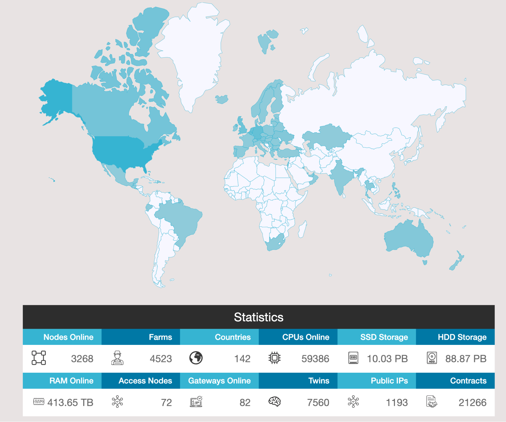

# Open Source Deployment

People everywhere in the world expand on daily basis see [https://stats.grid.tf/](https://stats.grid.tf/) and the explorer for mainnet is on [https://explorer3.grid.tf/](https://explorer3.grid.tf/) (see the nodes being added on our mainnet for TFGrid 3.0).

