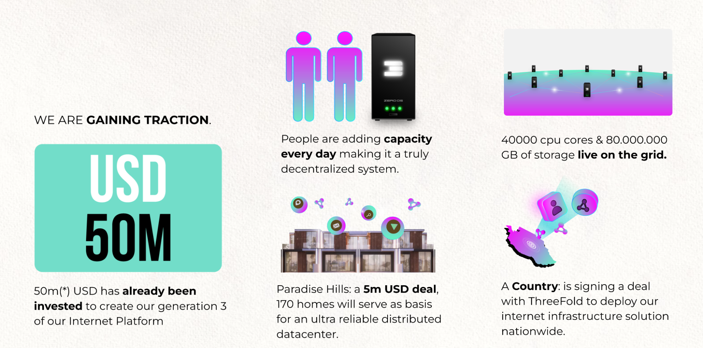
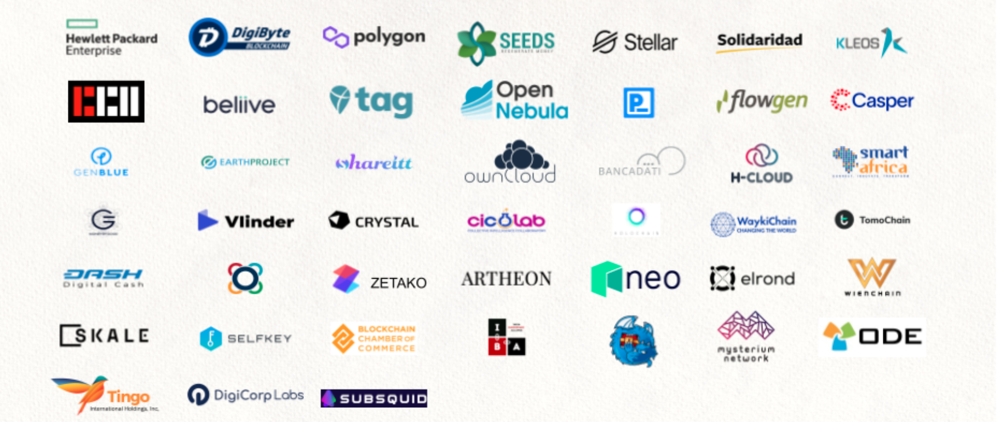

# Partners and Community First

# 

We are focussed on providing global decentralized IT capacity for any project in the world. We believe in partners, more than 40 partners are building on top of us already today. This needs to become thousands of them. We have blockchain constructs which allow partners to be part of ThreeFold and have their own revenue streams. We can be seen as a go2market vehicle for any software as a service or web business. 

Right now, we are mainly focussed on expansion though, see our 4 dimensions of Growth below. \

