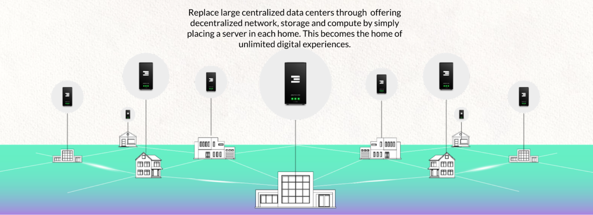
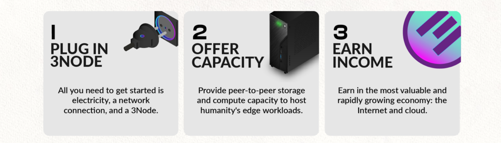
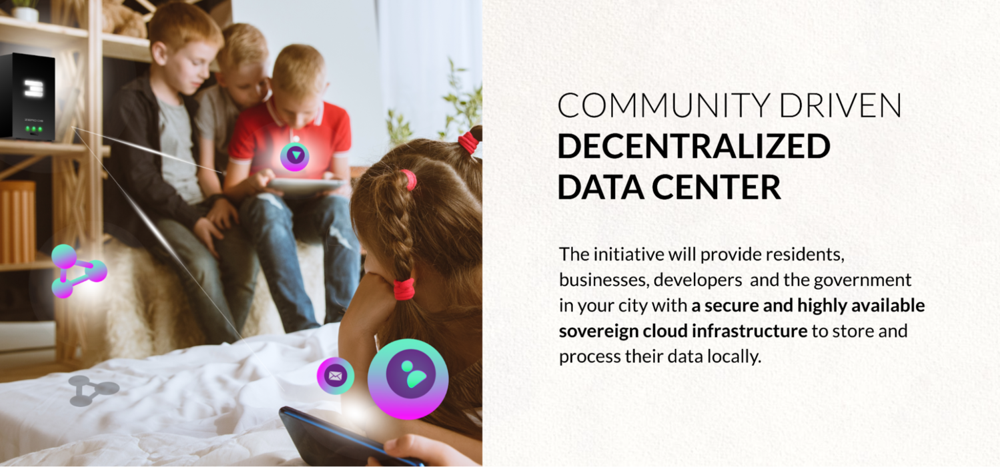

# How does it work?

## You can become an Internet Farmer today:

Farming Internet capacity is really easy and you can do it yourself today. Just buy a computer, go to our website, download our boot loader (which is a software which loads our operating system) and your computer is now a farming (mining) device that farms TFT, our Internet capacity reward token. If you do this yourself then we call this DIY (Do It Yourself) Internet Farming, more info see [https://library.threefold.me/info/threefold#/tfgrid/farming/farming_intro](https://library.threefold.me/info/threefold#/tfgrid/farming/farming_intro) 

## Additionally it makes a lot of sense to integrate in a real estate development project:

Imagine now a situation where people don’t have to do this by themselves, but where they can buy a house in which Internet Capacity is pre-integrated.  Now their house is a node in a distributed and decentralized data center, creating benefits for the real estate developer as well as the homeowner. It can be compared to what a solar panel would do. Just like a solar panel generates electricity for the people around it, in the same way, our 3Nodes (Internet Capacity Boxes) provide Compute, Storage and other Internet Services to the people and companies nearby. A company or government will be able to host their data center Internet applications in the distributed data center which is part of the real estate project, which delivers greater security and performance at a better cost. 

We call this: a “ThreeFold **Neighborhood Cloud.”**

## 

## Benefits of the Neighborhood Cloud Concept

Benefits for the Planet

* By enabling home owners to participate in a shared Internet economy, we avoid having to build power consuming data centers. Our digital twin technology consumes only 2-5 watt per person, which is nothing compared to the Internet today.
* We involve our sustainability partners in the real estate project to have an impact on the regenerative nature of a project.
* We impact at least 9 of the 12 Social Development Goals (SDGs)  with our approach.

Benefits for the Country

* When a country gets more Internet Capacity locally, fewer data centers need to be built.
* Data & applications remain in the country, this leads to more sovereignty.
* A local internet has higher performance, with faster speeds, lower latency, and easier scalability.
* Green, a ThreeFold Neighborhood Cloud, is carbon negative.
* More security, recently in Ukraine, data centers were the first target, this approach eliminates this risk.

Benefits for the Homeowner

* Freedom, there is no longer the requirement to be a product from the Facebooks of the world. You can own your data.
* Free access to a co-owned internet with all benefits possible.
* It's like having access to a super computer which provides an immersive gaming and metaverse experiencethat can be rendered in the cloud at high quality. This leads to incredible possibilities. The kids for sure will love it. The technical ones can even develop on the local cloud.
* Have access to community services, e-commerce, local services, collaboration tools, communication tools, etc.
* As delegated farmers, they will earn income (see simulation table below) and, with some luck, could create a significant passive income source, offsetting the home cost.
* More security, reliability, privacy and performance for their Internet experience.

Benefits for the Developer

* Faster & easier sales of the homes – in our first project, the developer sold a lot faster.  \
Within 2 months this developer asked us to do a 2nd project with double the amount of homes.
* Income for delivering Internet services to the companies, country and people around your property. 
* More financial income, because the developer becomes co-owner of the local Internet and gets X% of the INCA (see next page) proceedings. This can be quite substantial.
