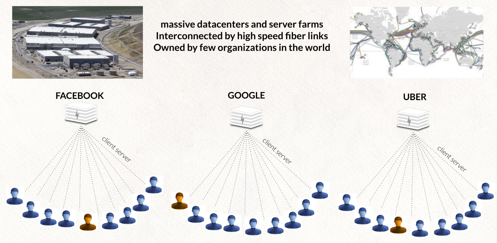
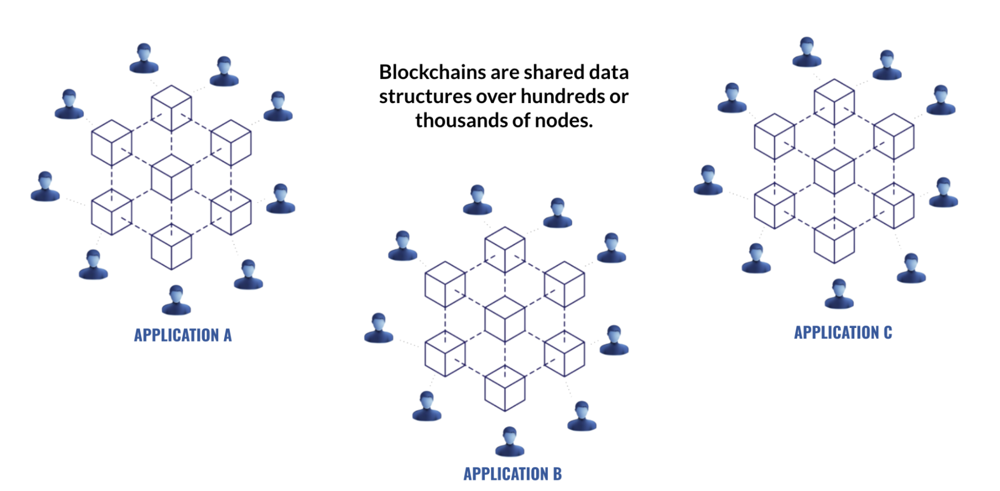

# The Internet Today

The internet today is constructed in a centralized way, we exist many times and became a product of big centralized services. There is also a real cyber pandemic going on, there are cyber attacks everywhere and backdoors in most of the electronic equipment we use. This architecture is unsafe, not scalable, power hungry and not able to deliver equality. Still more than half of this planet does not have decent affordable access to the internet.

Blockchain is a huge step in the right direction but it's a shared architecture distributed over the world where data gets replicated on many locations. It's a good technology choice for use cases like money, smart contracts, voting, digital notary and identity but not at all suited for building a new internet with. This is also called web 4. Developers still need to develop applications connecting to multiple blockchains and centralization is often not good enough.
