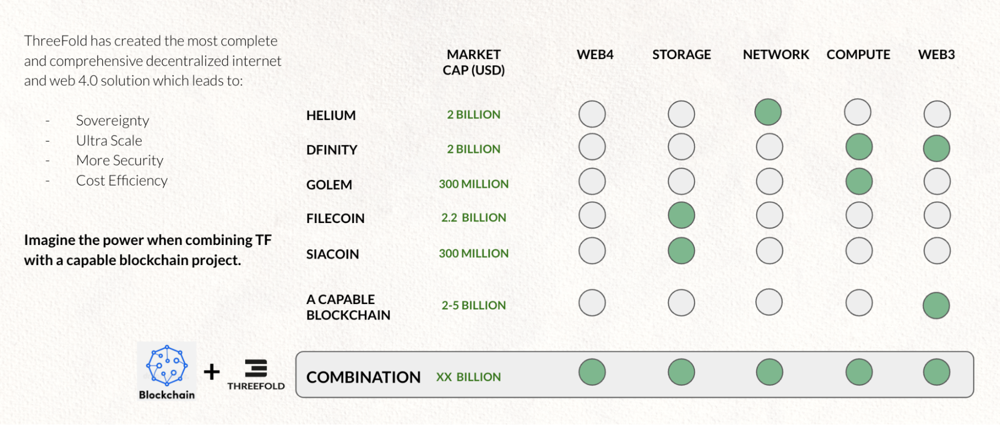

# The missing layer for a more decentralized world

A FEATURE COMPLETE INTERNET & MONEY SYSTEM.

ThreeFold has successfully developed a peer-to-peer cloud operating system running on bare hardware (directly using the computer native resources) to make all of the above possible.

**This is the result of 20 years of work.**

 \
Imagine the capabilities and potential of a combination of blockchain and our technology to deliver a feature complete internet and money system.