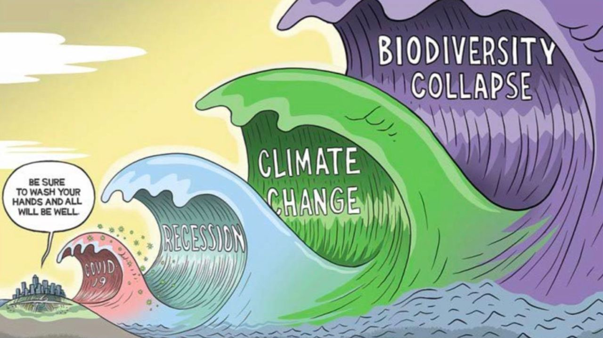
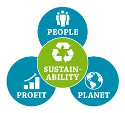

# Regenerative planet and people first approach

**The world is changing in front of us, we cannot deny it and we need to act now.** \

We are in the forefront of a growing movement, more and more companies want to prioritize people and planet positive policies. We are not swimming against the stream, we are part of a group of leaders of change and we are making real the zeitgeist of the 21st century. 

Companies and investors that fail to be part of this needed movement will seem like dinosaurs by 2030 and be valued by our communities accordingly.

<table>
  <tr>
   <td>
        
   </td>
   <td>We believe in:
        <ul>
            <li>Planet First</li>
            <li>People Second</li>
            <li>Profit As Result</li>
        </ul>
        

        Everything we do needs:
        <ul>
            <li>To have a chance to improve our planet situation (climate change, regenerative, less use of resources, …)</li>
            <li>To help our communities in becoming their best powerful and aware self, where love and respect comes first.</li>
        </ul>
        

        A more aware approach to global problems:
        <ul>
            <li>Humbleness (I am nothing)</li>
            <li>Gratefulness (planet and people first)</li>
            <li>Authenticity (I can be the true me and in my power)</li>
        </ul>
  </tr>
</table>

