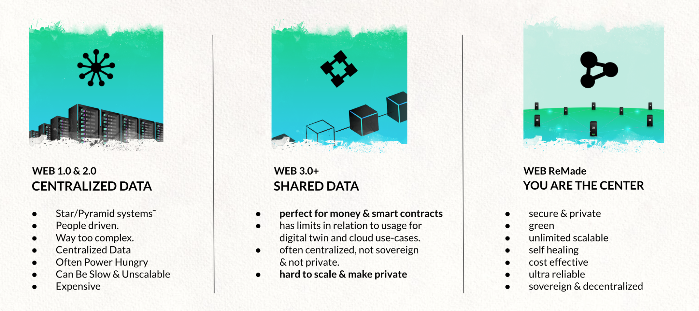
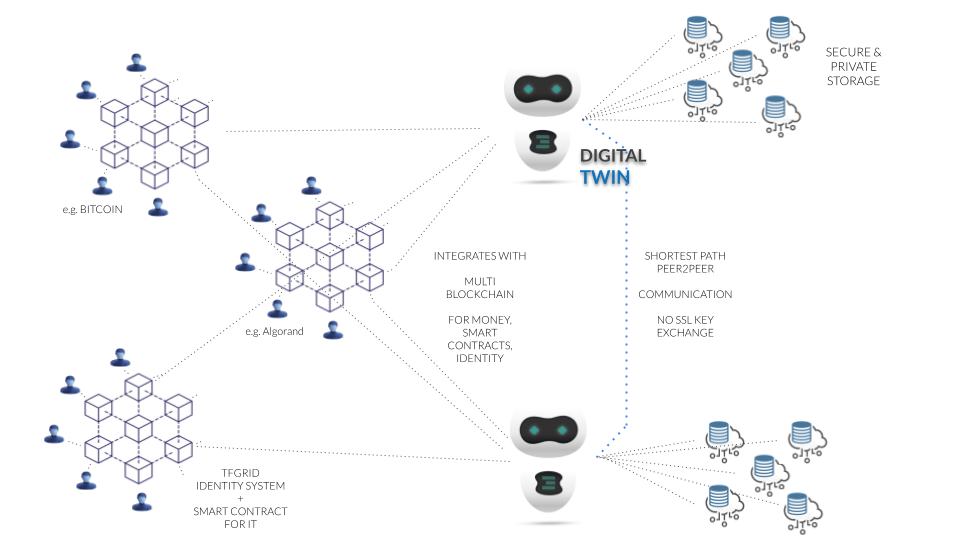

# Web Re-Made Architecture

We are brainwashed about the need to centralize & control everything, this leads to suboptimal systems and a lot of waste. Web 1,2,3,4 are all centralized by nature. The best the world has been able to come up with is a shared consensus driven architecture called blockchain which is good for certain use cases but suboptimal for many more. 

The solution is actually very simple, you should be the center of your digital life, you own all your data, you are your own application (we call this your digital twin), we believe +90% of your digital needs can be implemented that way. Blockchain technology is needed for items where consensus is required like identity, money, smart contracts…

There is a need for a co-owned global Internet infrastructure on top of which each of us can exist digitally, this is a dramatically different architecture with no centralization whatsoever and offering 100% equality as well as full data and application ownership. This has never been done because it's so different in design and goes away from any form of control by a money making company.

The Twins live on top of the ThreeFold Grid which is a co-owned infrastructure layer where every Internet Farmer makes money by providing storage, compute & network capacity to the people around them.

The twins communicate with each other and the rest of the world (existing centralized services) as well as existing blockchain technologies. The data is using a novel storage technology which makes sure your data is safe and can never get lost, yet it's only owned by you and not even a quantum computer can hack it.

Imagine the benefits for use cases like video conferencing:

