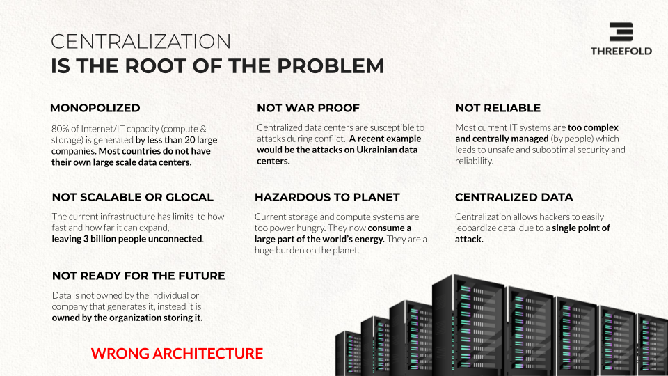

# Why a new internet?

THE CURRENT INTERNET CANNOT KEEP UP WITH EMERGING DEMAND.

The digital economy and our future as digital citizens are wholly dependent on the Internet. However, today’s Internet and cloud infrastructure is too centralized, cannot grow fast enough to meet growing demand nor support future use cases, and  promises neither data sovereignty nor equality. 

More than 80% of today's Internet infrastructure is owned by less than 20 organizations. The lack of ownership of our own data and the consequent commercialization of that data is a major concern for both individuals and governments alike. The future neutrality and democratization of the Internet is an absolute necessity in this regard.

The Internet is growing like crazy. Today the Internet is mainly delivered out of data centers, which are huge buildings containing up to millions of servers. They consume a lot of energy and are very expensive to build. Building more data centers is not enough…

* There are not enough data centers and this won't change in the short term: it's too expensive and complex.
* Data centers are not war-proof and they are vulnerable to catastrophes (see Ukraine).
* They are not glocal (close to the source where required) and they are too centralized: as such, they present a single target for hackers.

ThreeFold is different, is an Internet of Internets solution, people can build and own their own internet in their region.

“ThreeFold Neighborhood Clouds'' are the alternative to centralized datacenters, transforming a typical neighborhood into a decentralized and distributed data center. Each home, office or commercial property can host a 3Node (a computer delivering Internet Capacity in the form of storage and compute power). These 3Nodes are interconnected over fast local networks (e.g. it can be in the neighborhood as a fiber ring or using local Internet existing cable infrastructure) and offer a quantum safe storage system, metaverse/gaming rendering cloud (coming in 2023), compute cloud, a platform for our digital applications to enable our day to day digital life, and more.

