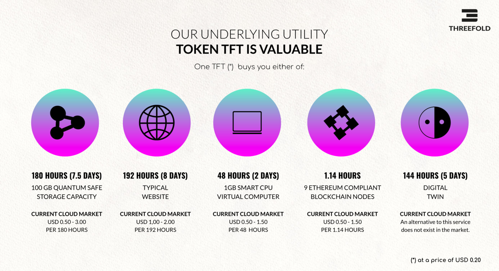
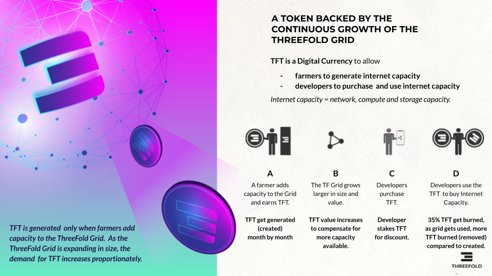

# TFToken = the Valuable Token of The Internet of Internets

ThreeFold uses the power of digital currency models to create value. 

TFT is valuable and delivers the resources described above for a certain number of hours. You can do much more with a TFT than what is described above. It's just an example, but it shows the real utility of a TFT. \
See [https://library.threefold.me/info/threefold#/tokens/grid_valuation](https://library.threefold.me/info/threefold#/tokens/grid_valuation) 

## Our Token is Properly Constructed

See [https://library.threefold.me/info/threefold#/tokens/tokenomics](https://library.threefold.me/info/threefold#/tokens/threefold__tokenomics)
