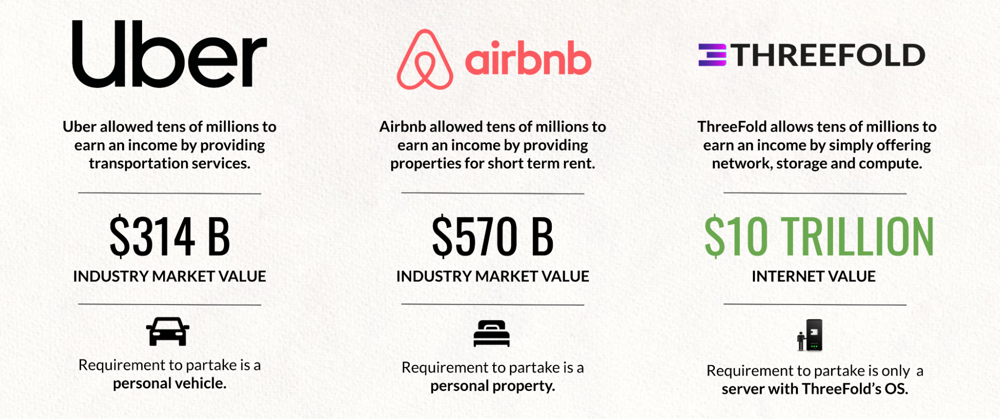

# 3 Dimensions in Token Creation & Utilization

### 1. Proof of Capacity = Farming

3Nodes (computers) deliver storage, compute, and network capacity as the basis for our new Internet.  \
Our Unique Operating system measures the capacity as provided by a farmer and this gets registered in our blockchain. 

_TFT Reward per Month = 3Node Capacity * TFT Reward per Unit of Capacity / Month._

This TFT Reward Amount : 

* is recorded in the blockchain at the moment of 3Node registration and verification,  \
every hour our operating system and blockchain verifies the available capacity.
* Is calculated so that it generates per month  +- 1/5  of all TFT needed to buy all capacity at the point of registration.  \
e.g. if a 3node can generate commercial value of 100 USD per month for all internet capacity and the TFT price is 0.1 at that point, then _100*0.1/5 _is +- the amount of TFT that will be rewarded (generated) per month. \
This means TFT is by design +- 5 times undervalued in relation to 100% utilization at connection.
* The TFT reward amount is agreed upon by the DAO per Regional Internet to make sure there is consensus.

The farmer can receive boosters rewards (still to be defined) if certain achievements are achieved e.g. uptime, good bandwidth to Internet, good utilization. There is no link between farming & utilization.

More info see [https://library.threefold.me/info/threefold#/tfgrid/farming/proof_of_capacity](https://library.threefold.me/info/threefold#/tfgrid/farming/proof_of_capacity) 

Farming is the only way in which TFT are created (minted) !!!! 

### 2. Proof of Expansion = Staking

Staking is the mechanism to let the community invest and benefit from the growth of the ThreeFold Grid. \
The main TFT is like the reserve currency for the larger Internet of Internets, the TFT is the currency needed to go in between all the different Internets. To establish this Internet, a lot of TFT are needed.

We have 3 major staking concepts:

* Internet of Internets Layer: TFT Validators = 300m TFT
    * Our TFT Validators (our master TFT money chain & identity chain) has 100 Validators.
    * ½ have been reserved already
* Regional Internet TFGrid Validators = 1,000 (regions) x 100 (nr validators) x 500,000 (staking per validator) = 50 Billion TFT
    * At current price of 0.1 we need 50 billion TFT (in case there would be 1000 Regional Internets)
* Regional Internet DEFI Pool = 1,000 x 5,000,000 =  5 Billion TFT
    * This DEFI pool is between the master TFT and TFT on each regional level.
    * Each regional Internet needs at least 500k USD worth of TFT at that point in the DEFI pool.

There are 800m TFT right now. The above described staking requirement needs +50 Billion TFT if the TFT would not raise in price, which is not possible. In other words, TFT will have to rise in price. Please do note the other mechanisms like burning will kick in as well.

### 

## 

### 3. Proof of Utilization = Cultivation

When users use the capacity of the grid they need TFT, these TFT are burned and given to the channel.

Percentage	Description				Remark

35%		TFT burning				A mechanism used to maintain scarcity in the TFT economy.

10%		ThreeFold Foundation			Funds allocated to promote and grow the ThreeFold Grid.

5%		Validator Staking Pool			Rewards farmers that run TFChain 3.0 validator nodes.

50%		Solution providers & sales channel 		(optional more burning)

In a couple of years 35% burning will be more than farming. This means as the grid grows, more tokens will be burned compared to farmed, which leads to more scarcity. In the beginning, utilization is small compared to farming & staking.

This will happen mainly in the last phase of our expansion mode as mentioned above.

More info see [https://library.threefold.me/info/threefold#/tfgrid/farming/proof_of_utilization](https://library.threefold.me/info/threefold#/tfgrid/farming/threefold__proof_of_utilization)

* 
* 

# 

