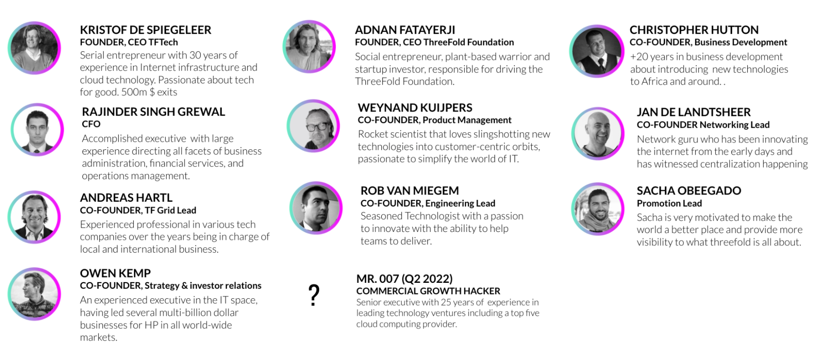

# Experience Matters

We were fortunate to be part of the first rollout of the Internet in the early 1990’s.

Our team has multiple world records for scaling projects on the Internet, invented the first data deduplication system for backup, the first ultra scalable distributed storage system using forward-looking error correcting codes, one of the first cloud systems, the first always consistent distributed database, and the first decentralized operating system using blockchain technology. The team has achieved over +500m USD in exits to Sun Microsystems, Western Digital, Verizon, Symantec, and others. 

Our ThreeFold system brings us back to the Internet as originally conceived. A collaborative and community-based network of compute, storage and network resources, peer-to-peer connected and delivered by all. Only this time, we can use advanced technologies and structures which were only developed very recently.

Kristof De Spiegeleer: Founder/Chairman ([linkedin](https://www.linkedin.com/in/despiegk/))

* 30 years experience building startups in the high tech space
* 7 exits, +500m USD

Mr 007, Q2 2022: Commercial Growth Hacker

* A senior technology executive, deeply vested in global, high growth and emerging markets. 25 plus years experience most recently as Corporate VP at one of the leading cloud computing providers (+100B). A board member, strategic advisor and social entrepreneur.
* Extensive sales and strategic partnership development experience particularly with enterprise and government sectors. Will help Threefold build a specialized sales team and strategic partnership frameworks to address the growing national and sovereign cloud requirements at country-wide scale. A growing trend for  governments, and some enterprise and strategic sectors and communities that Threefold can certainly fulfill and develop.
