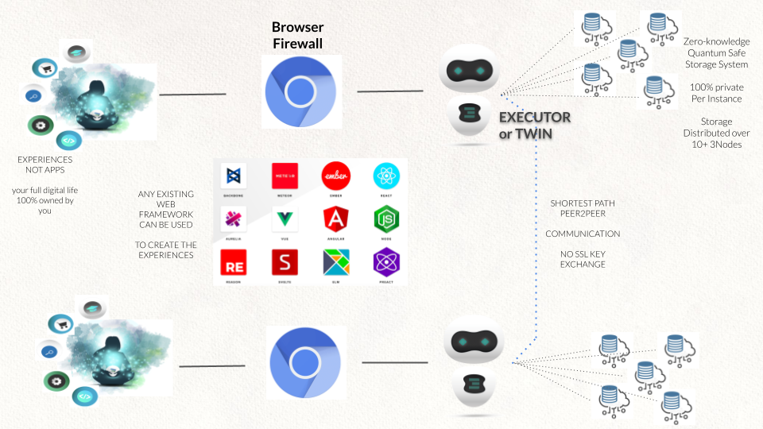
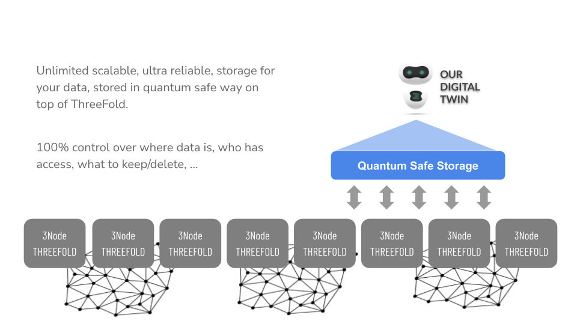
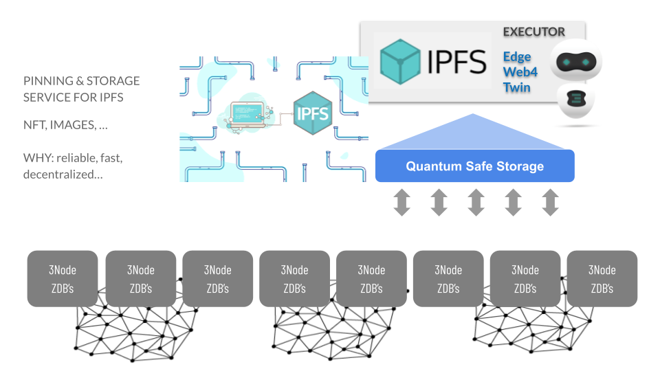
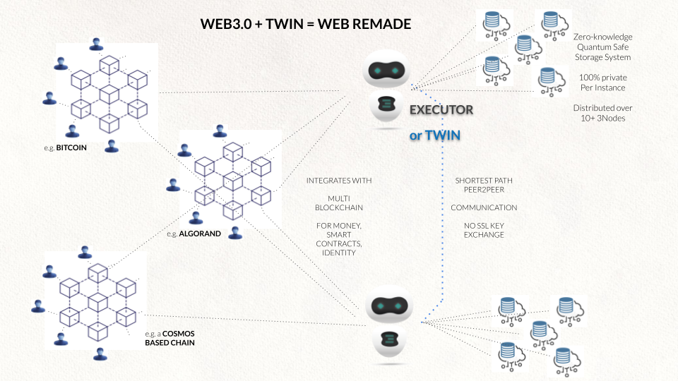

# Tech: Digital Twin Technology

Each twin is hosted on the ThreeFold Grid. The data is using the quantum safe storage layer and can never be corrupted or lost. This architecture is super scalable, billions of twins can be deployed. \
 \

 \

Each digital twin talks directly to the other twins, this keeps information flow local and provides for a more green internet experience, it also improves security, performance and privacy. \

The twin system is also compatible with IPFS to integrate with the web3 world.

Each twin can talk to any blockchain around (web3) to arrange management of digital currencies and peer2peer exchange of value. The Twins are compatible with any major blockchain technology.

The twins can also talk to web 2 and own deployed client-server applications on top of the TFGrid. This leads to a super scalable & polyvalent ecosystem.

