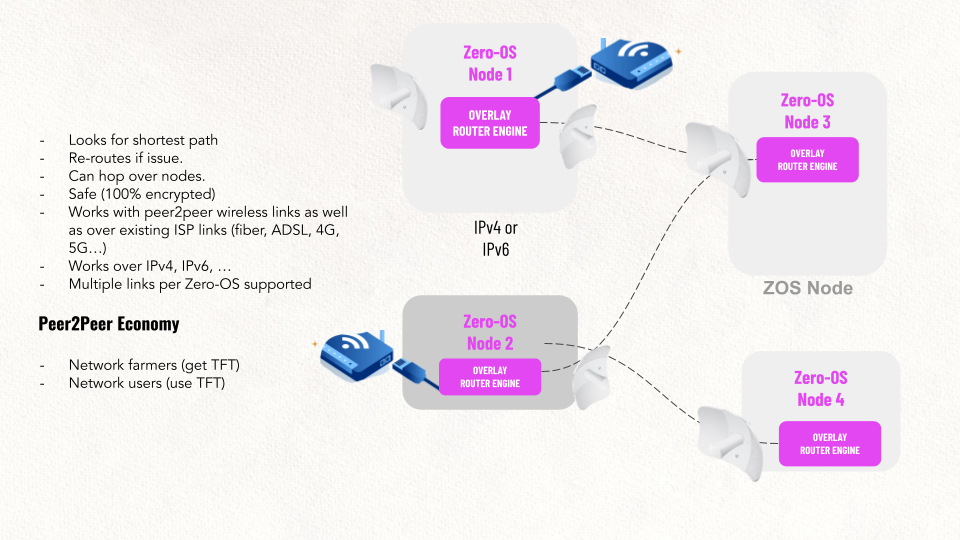

# Tech: Our Planetary Network Provides Ultimate Connectivity

Our network layer connects anything to anyone. We have clients for iPhone, Android, Windows, Linux and OS.

The end 2 end encrypted network will look for the shortest path between any app or user. It has a built-in DNS system and works seamlessly together with existing networks like the current Internet backbones and providers, satellite providers like starlink, 5G, Meshed Wireless (build our own networks with the community) or any other mobile technology. It's the swiss army knife for network connectivity in the world which tries to keep our data flowing all the time in all security.

Your network address is unique to your device and you and never changes, doesn’t matter how you will communicate or where you are. If links go down the Planetary network client will look for other paths.

### Read more about our technology in [https://library.threefold.me/info/threefold#/technology/technology](https://library.threefold.me/info/threefold#/technology/technology) 
