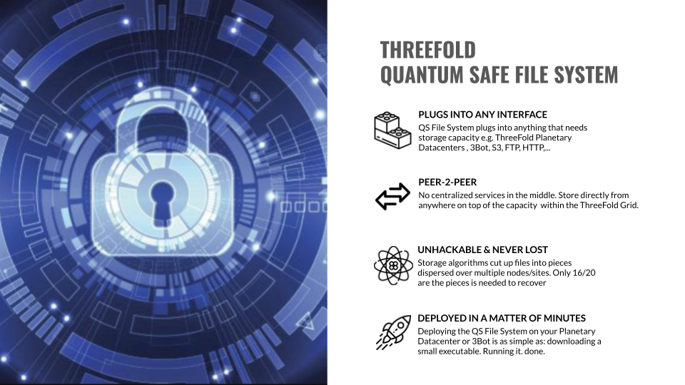
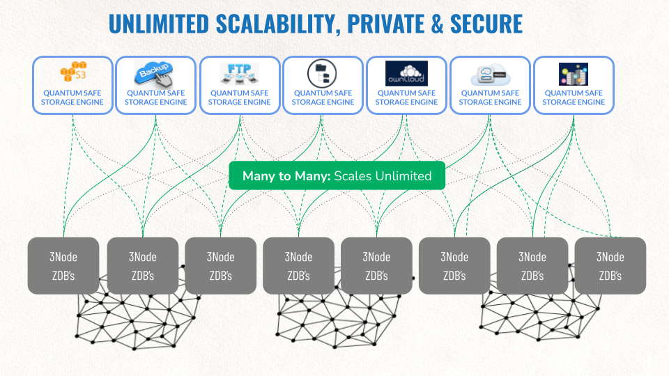

# Tech: Our Quantum Safe Storage System Protects Your Data

Your data is unlimitedly scalable and can never be lost or corrupted. **You are the only one who owns your data.**

ThreeFold nodes or even full data centers can go down, your data is always there, available forever.

Your quantum safe storage system is very cost effective,** the cost of farming 1 TB of storage per month can be less than 1 USD, the market price is between 20 and 180 USD. **

Our storage system is the result of 20 years of engineering and many iterations, our last company was acquired for 300m USD for a subset of this technology.
