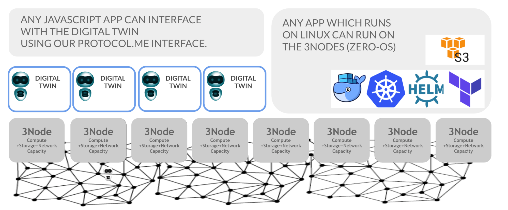

# Tech: Missing Layer for Blockchain, Storage, Compute & GPU Workloads

## Develop For Digital Twin  versus Your Own Apps On Capacity Layer (TF Grid)

Zero-OS (see further) is used on the 3Nodes and provides the base layer with storage, compute & network capacity. 

 \
The Twins are a new development paradigm for building ultra scalable & sovereign internet dapps of the future, we use this ourselves to deploy the projects we are doing with large banks and some countries who are ready for a more regenerative internet future for their citizens.

Thanks to our Smart Contract of IT layer you can still use industry standard tools like kubernetes, helm, terraform, … to deploy any workload you would want, our solution is compatible with anything which can run on linux our additional storage and network primitives provide additional benefits.

### Read more about our technology in [https://library.threefold.me/info/threefold#/technology/technology](https://library.threefold.me/info/threefold#/technology/technology) 
