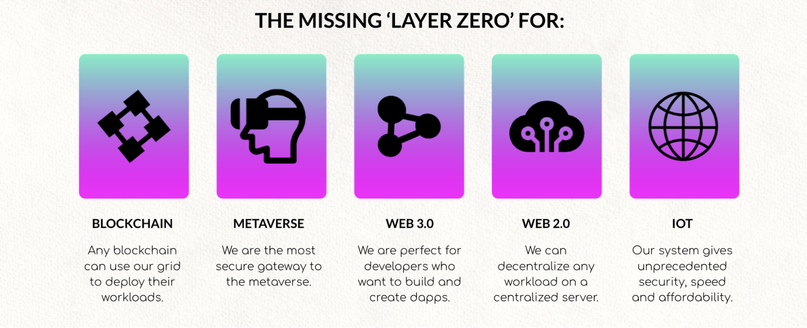
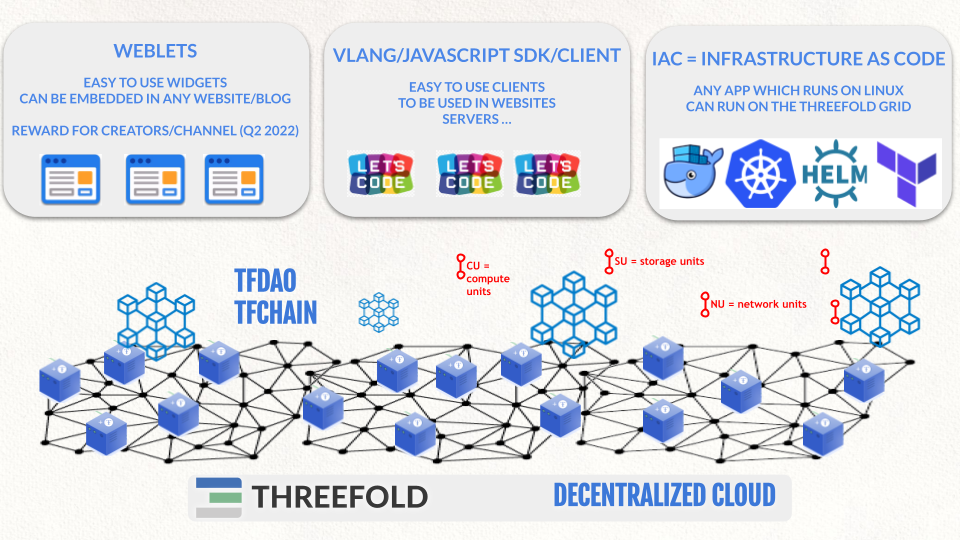

# Tech: Zero-OS = blockchain driven secure operating system

Our Decentralized Operating System (called Zero-OS) allows every company or person in the world to farm (mine)  \
Internet **compute**, **storage** or **network** capacity which can be used by everyone to host their Internet solutions:

 \
Our blockchain provisioning/utilization layer allows everyone in the world to provide or consume compute, storage and network capacity in full consensus. The TFT is the Utility Token which enables the exchange of value between participants and makes this possible. There are multiple possibilities how to interact with the capacity layer of ThreeFold Grid.

 \

ThreeFold 3Nodes (the computers that provide the storage, compute and network capacity), can be as small as a 100 USD device or a big server for in a data center of 50,000USD per server. There is no limit to the scale we can achieve.

Each layer is as distributed as possible, already today a lot of capacity has been deployed in the world see [https://stats.grid.tf](https://stats.grid.tf) .