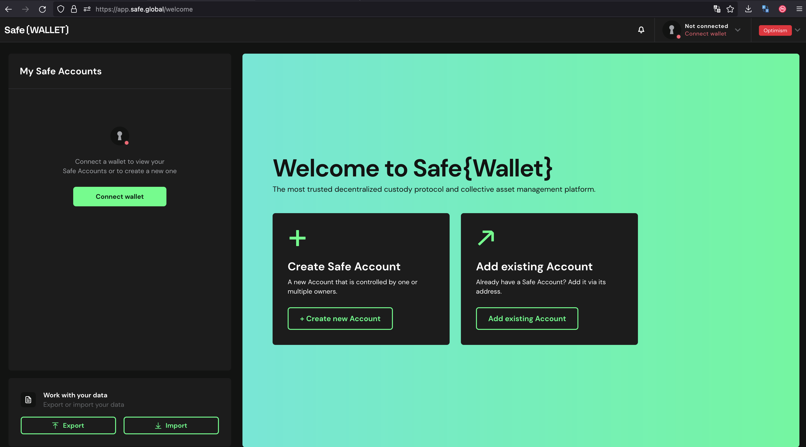
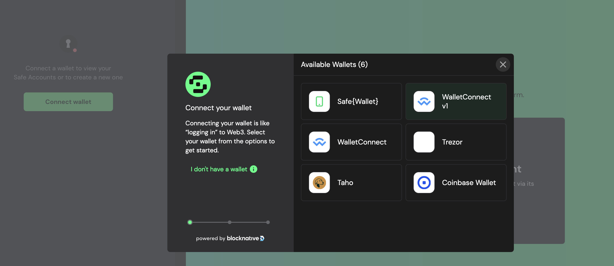
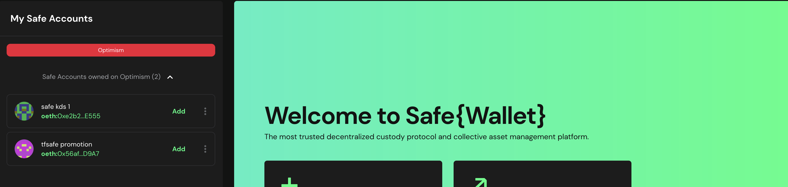
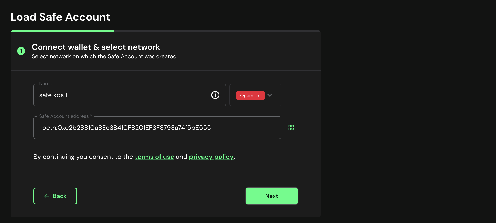
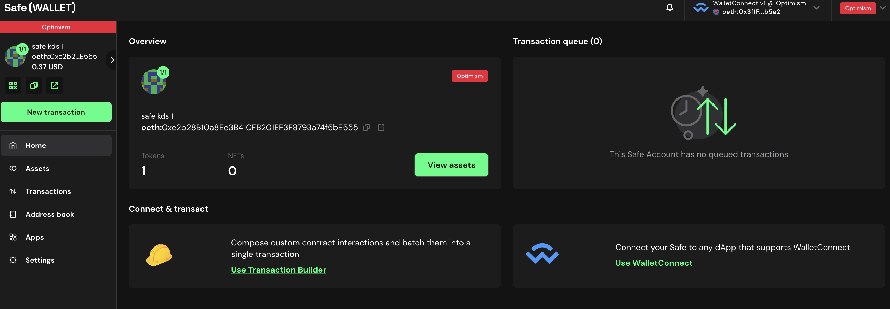
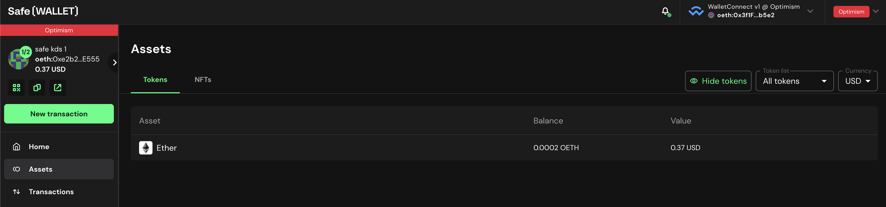

# Gnosis Safe

See https://safe.global/

## start page



If you have already exported your safe accounts you can import it here.

## Pre-requisites

- make sure you have onekey wallet on phone
- make sure you have account active
- make sure you are on Optimism Network 
- make sure there is minimal ethereum in your wallet (10 USD is ok)

## connect wallet to get started



Choose wallet connect v1

You will get a QR code

Go to our onekey wallet on your mobile phone (see instructions for making connection).


Click on right top level 

- make sure your are on Optimism Network and chose your right account

## if you already have wallets you will see



The web page recognizes that I already had gnosis safe wallets before, I can now add them by just klicking on ```Add```



make sure you are on optimism


success:



no I can see how my gnosis wallet is active and in my case had some funds.

## If you don't have a wallet yet

You can add a wallet and attach to your Ethereum account on Optimism

## How to find the address of your Safe Account



see left top, the copy icon.

this can also show a QR code in case someone wants to send money to this multisignature wallet.

An address is like

```oeth:0xe2b28B10a8Ee3B410FB201EF3F8793a74f5bE555``` 

Note the prefix, sometimes its needed to remove everything before : to use the address.

> important make sure you always use optimism chain when using this address, otherwise your e.g. receiving money is lost.

