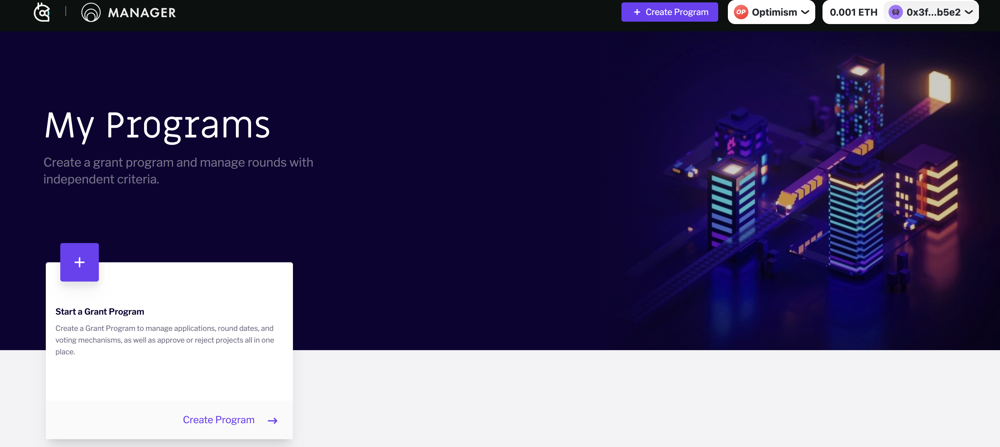

# grantbuilder

## create the program

go to https://manager-gitcoin-co.ipns.dweb.link/#/program/create

Click on connect wallet.

- Make sure the metamask is well configured on right chain (optimism) and there is small eth in your account.

## some remarks

> when create a program make sure to use a gnosis safe wallet as operator !!! and make sure the wallet has some ETH funds on the optimism chain.

You can now create a program, make sure your metamask account used to do the transactions has money and is part of the gnosis safe wallet which is the operator.

