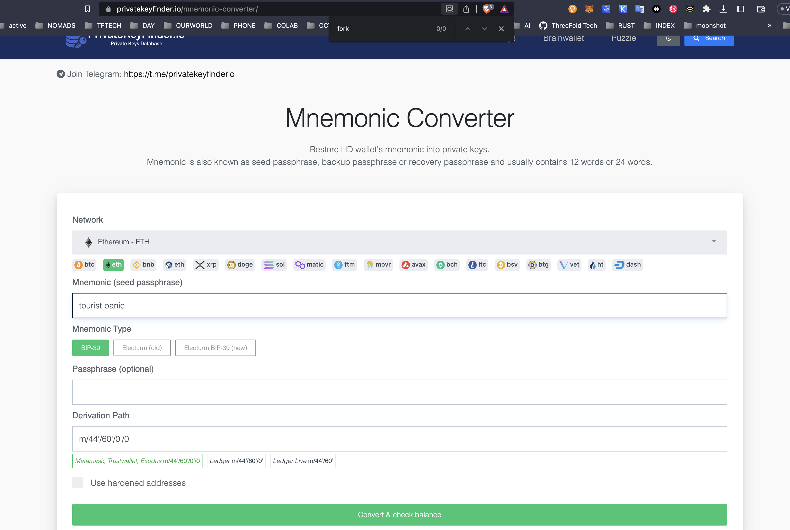

# Convert mnemonic to private key

see https://privatekeyfinder.io/mnemonic-converter/

In this case use eth, BIP39

after you do convert, the first address as shown on  the list below (which I won't show for security), has your private key.

This private key can be imported in your Metamask wallet.

