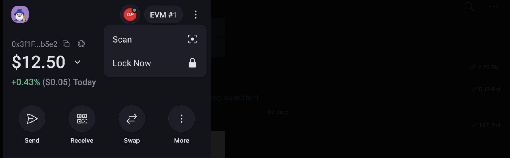
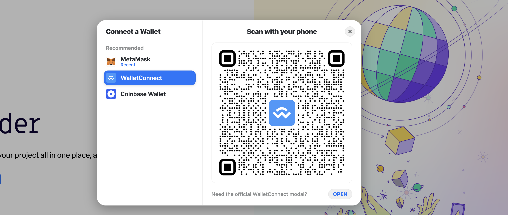

# Onekey Wallet

A good wallet with support on many platforms and opensource

> https://www.onekey.so/

I've installed the mobile wallet (android in my case)

## Connect web browser on desktop to mobile onekey wallet

How to scan for a connection

Click on the right side next to EVM, the 3 dots, do scan.

Now scan the QR code on your web browser

This is example QR code for walletconnect (v1).

Just scan from mobile, now the connection will be made.

(if it doesn't work can test the official wallet connect model at bottom).

