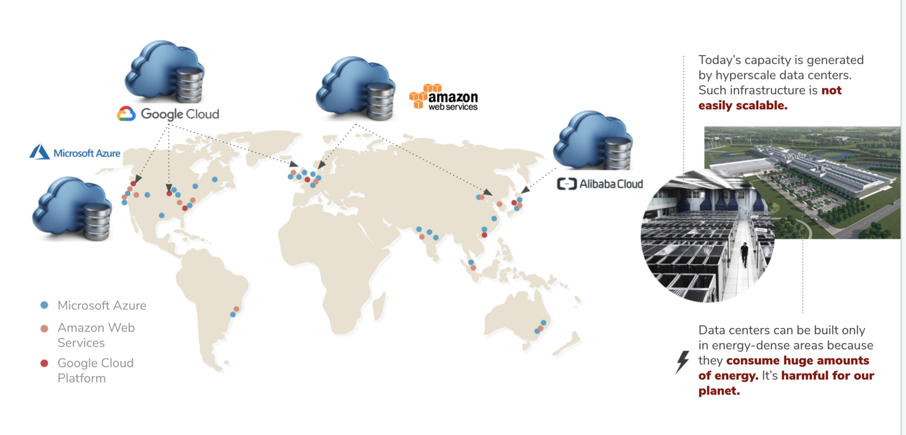
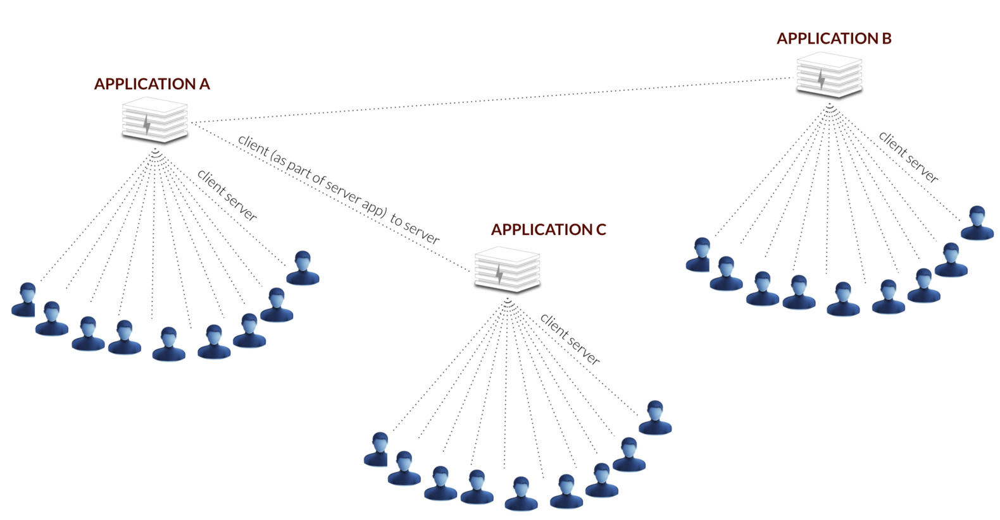
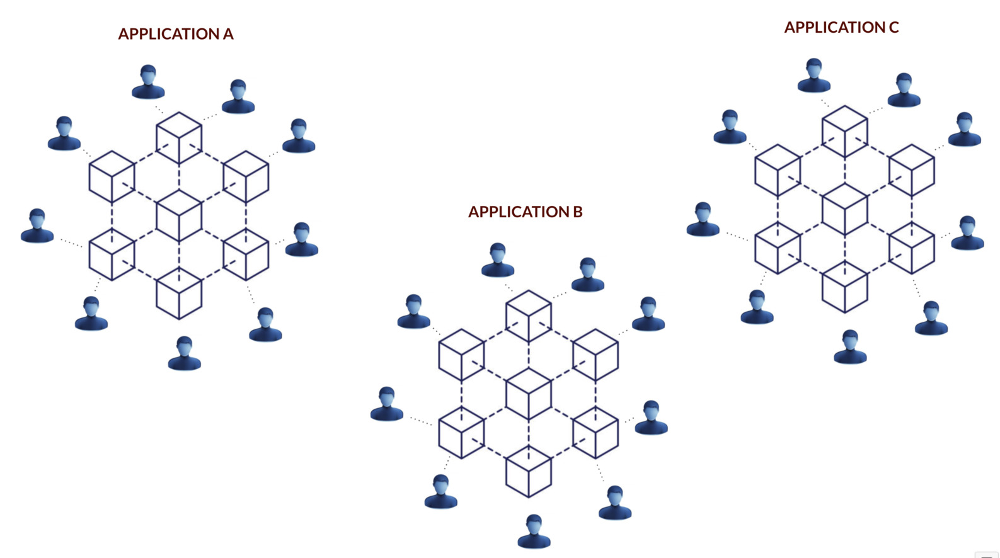
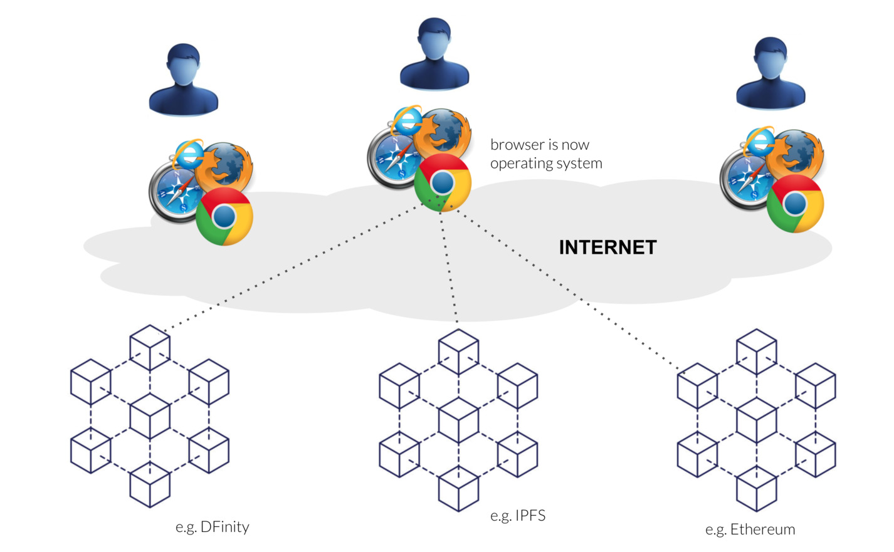
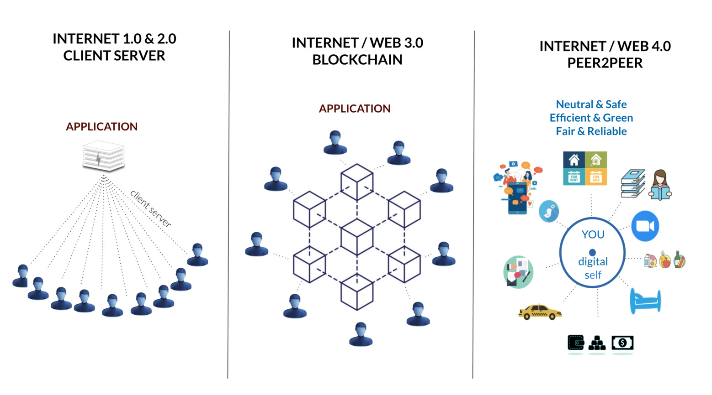

# Internet Evolution to Web 4.0

### Classic Internet

Everything is structured as client-server model

- The servers run as applications inside huge datacenters using a lot of energy
- Most of the processes in those servers are being repeated = highly inefficient
- We exist 100x times, very inefficient
- This leads to a lot of centralization -> insecure, as well as abuse of our data
- This has also been called Web 1.0 and Web 2.0

### Blockchain Based Web 3.0 Vision

Blockchain decentralized the server, but in principle it remains a client - server model

- It is definitely a step in the right direction but the paradigm is the same
- We as users still exist in different systems, and have to deal with different applications (protocols)
- These blockchains can be integrated, and through Web 2.0 concepts the web application can interact with multiple blockchains at the same time
- This has also been called Web 3.0

The browser has now become our operating system running on javascript. All applications run in our browser and interact with multiple blockchains.

> Please note we are 100% compatible with Web3 and we support this way of working completely. We see ourselves as a missing layer for Web 3.0.

### Evolution To Peer2Peer

### The Web 4.0 Digital Twin Vision

In the Web 4.0 vision, the user has been put in the center (digital twin usecase)

- you in the center of your digital life
- blockchain only needed for specific functions (money, identity, smart contracts, ...)
- internet 10x more efficient
- data sovereignity for all
- an internet created by all for all = **be the internet**

