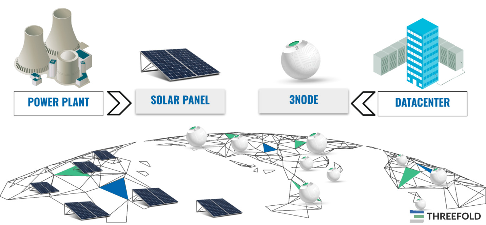

## The ThreeFold Grid Provides the IT energy

Each 3Node is an IT Power generator. The TFGrid is the network of these 3Nodes.

Needs to be super simple, just like a solar panel generates electricity.

- The 3nodes do for internet what solar panels do for large scale electricity power plants.
- They allow everyone to contribute to a new internet.
- People investing in the 3nodes are called [farmers](farming_home).
- Each farmer receives tokens called TFT for providing this IT capacity.
- IT Capacity is storage, compute and network capacity for this upgraded internet.
- The Twins need TFT to pay for the IT capacity they need.
