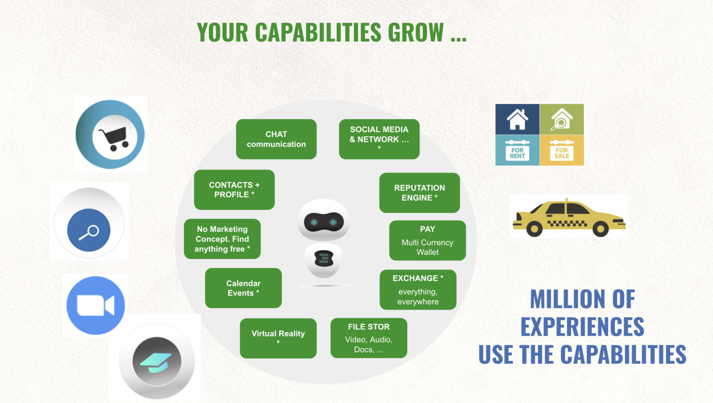

# Web 4.0 Digital Twin

The ThreeFold web4 Digital Twin architecture puts the user in the center of its digital life, for that every user owns a digital twin running on the ThreeFold grid.

Every user uses any browser to access their digital twin. 

### The twin has many capabilities:

The twin has basic capabilities which are strongly version controlled, but contributions from the global community are more than welcome.

### Experiences

Developers create Experiences using the twin capabilities, not apps. 

Experiences re-use the same capabilities.

This has huge benefits

- a lot less development effort needed per experience
- more sustainable (less energy loss)
- easier for user, no duplication
- more simplicy
- more powerful

