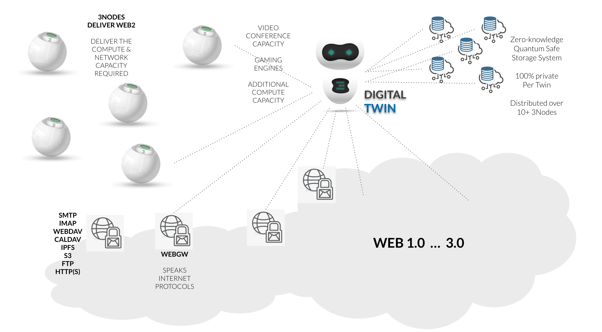

## Integration to Web 2

Each Digital Twin can talk to the classic internet and web 2 interfaces.

  
 

Each Twin knows how to talk legacy protocols like SMTP, POP3, DNS, ... (in development) to allow seamless integration.

In case more compute is required for a specific usecase like gaming, AI, data processing the twin can spin up compute & storage requirements on the TFGrid and as such become way more powerful for the time required.

This leads to huge flexibility and efficiency.

Any application can be developed on top and is compatible with existing development world.