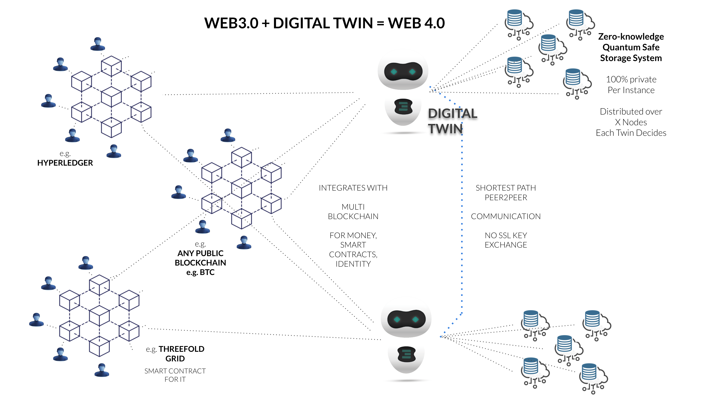

## Integration with blockchain (web 3)

While the twin is a better alternative than the blockchain for many protocols, certain tasks still require a blockchain, such as

- money
- smart contract between people
- consensus between lots of people around info
- proof of authority, authentication, ...
- reputation system

  

Each twin can talk to any required blockchain in a way that is 100% transparent for the user.
